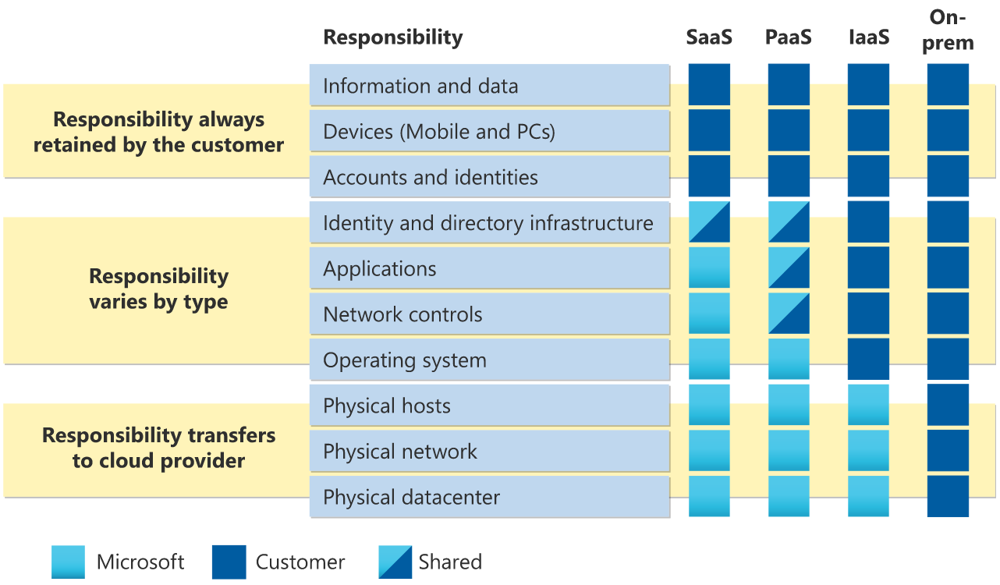
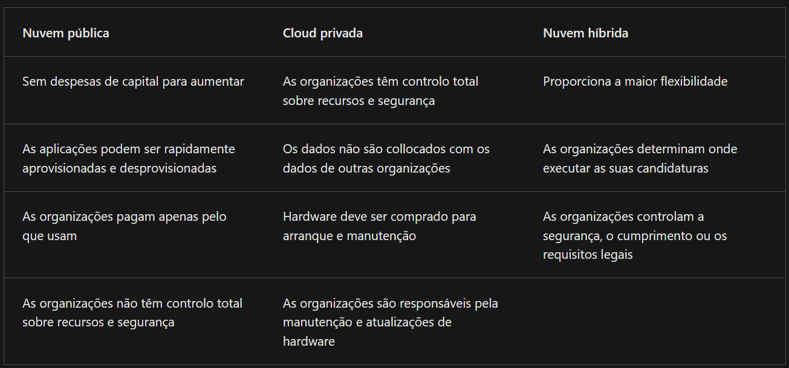

# **Learning Courses:** :books::brain:

- ## This is the ***root directory*** of Azure learning and projects: :mortar_board::closed_book::robot:.

***

- ## **SUMÁRIO:** :round_pushpin:.

1. **Exam AZ-900: Microsoft Azure:**

    1. Descreva a computação em nuvem;

        1. Defina a computação em nuvem.
        1. Descreva o modelo de responsabilidade partilhada.
        1. Defina modelos em nuvem, incluindo público, privado e híbrido.
        1. Identifique os casos de utilização adequados para cada modelo de nuvem.
        1. Descreva o modelo baseado no consumo.
        1. Compare os modelos de preços em nuvem.

    2. Descreva os benefícios da utilização de serviços na nuvem;
    3. Descreva os tipos de serviços em nuvem.

***

1. ## **Exam AZ-900: Microsoft Azure:**

    1. ### **Descreva a computação em nuvem:**

         1. #### **Defina a computação em nuvem:**

            - A computação em nuvem é a prestação de serviços de computação através da internet.
            - Como a computação em nuvem utiliza a internet para fornecer estes serviços, ela é altamente escalável.
                - Infra
                - Armazenamento
                - base de dados
                - networking
                - outros:
                    - IoT
                    - Machine Learning
                    - IA
        2. #### **Descreva o modelo de responsabilidade partilhada:**

            - Responsabilidade de gestão de infra e software partilhada, estas responsabilidades são partilhadas entre o fornecedor de cloud e o consumidor.
            - A segurança física, a energia, o arrefecimento e a conectividade de rede são da responsabilidade do fornecedor de cloud.
            - O modelo de responsabilidade partilhada está fortemente associado aos **tipos de serviço cloud**:
                1. infraestrutura como serviço (IaaS),
                2. plataforma como serviço (PaaS),
                3. software como serviço (SaaS).
            - IaaS atribui mais responsabilidade ao consumidor, com o fornecedor de cloud a ser responsável pelas noções básicas de segurança física, energia e conectividade. Do outro lado do espectro, o SaaS atribui a maior parte da responsabilidade ao fornecedor de cloud. A PaaS, sendo um meio termo entre IaaS e SaaS, assenta algures no meio e distribui uniformemente a responsabilidade entre o fornecedor de cloud e o consumidor.

                

            - Cliente será sempre responsável por:
                - As informações e os dados armazenados na cloud
                - Dispositivos com permissão para ligar à sua nuvem (telemóveis, computadores, etc.)
                - As contas e identidades das pessoas, serviços e dispositivos na sua organização

            - O fornecedor de cloud é sempre responsável por:
                - O datacenter físico
                - A rede física
                - Os anfitriões físicos

            - O modelo de serviço irá determinar a responsabilidade por coisas como:
                - Sistemas operativos
                - Controlos de rede
                - Aplicações
                - Identidade e infraestrutura

        3. #### **Defina modelos em nuvem, incluindo público, privado e híbrido:**

            - Os modelos em nuvem definem o tipo de implantação de recursos em nuvem. Os três principais modelos em nuvem são: privados, públicos e híbridos.

            1. **Cloud Privada:**
                -É uma nuvem (fornecendo serviços de TI através da internet) que é usada por uma única entidade.
                - Uma nuvem privada também pode ser hospedada a partir do seu datacenter no site.
                - Pode também ser hospedado num datacenter dedicado fora do local, potencialmente até por um terceiro que tenha dedicado esse datacenter à sua empresa.

            2. **Cloud Pública:**
                - Uma nuvem pública é construída, controlada e mantida por um fornecedor de nuvem de terceiros. Com uma nuvem pública, quem quiser adquirir serviços na nuvem pode aceder e usar recursos. A disponibilidade pública geral é uma diferença fundamental entre nuvens públicas e privadas.

            3. **Cloud híbrida:**
                - Uma nuvem híbrida é um ambiente computacional que utiliza nuvens públicas e privadas num ambiente interligado.
                - A nuvem híbrida pode ser usada para fornecer uma camada extra de segurança.

                
            4. **Multi-núvem**:
                - Num cenário multi-nuvem, você usa vários fornecedores de nuvem pública. Talvez use diferentes funcionalidades de diferentes fornecedores de nuvem. Ou talvez tenha começado a sua jornada em nuvem com um provedor e esteja em processo de migração para um fornecedor diferente. Independentemente disso, num ambiente multi-nuvem você lida com dois (ou mais) fornecedores públicos de nuvem e gere recursos e segurança em ambos os ambientes.

            - Soluções Azure para lidar com diferentes modelos e transições:
                1. **Azure Arc:**
                    - Azure Arc é um conjunto de tecnologias que ajudam a gerir o seu ambiente em nuvem. O Azure Arc pode ajudar a gerir o seu ambiente em nuvem, seja uma nuvem pública apenas no Azure, uma nuvem privada no seu datacenter, uma configuração híbrida ou até mesmo um ambiente multi-nuvem em execução em vários fornecedores de nuvem ao mesmo tempo.

                2. **Solução VMware no Azure:**
                    - E se já estiver estabelecido com VMware num ambiente de nuvem privada mas quiser migrar para uma nuvem pública ou híbrida? Azure VMware Solution permite executar as suas cargas de trabalho VMware em Azure com integração e escalabilidade perfeitas.
        4. #### **Identifique os casos de utilização adequados para cada modelo de nuvem:**

            1. Despesas de capital (CapEx):
                - É normalmente uma despesa única e adiantada para comprar ou garantir recursos tangíveis.

            2. Despesas operacionais (OpEx):
                - Gasta dinheiro em serviços ou produtos ao longo do tempo.

            - A computação em nuvem é enquadrada no OpEx porque a computação em nuvem opera num modelo baseado no consumo. Com a computação em nuvem, você não paga pela infraestrutura física, a eletricidade, a segurança, ou qualquer outra coisa associada à manutenção de um datacenter. Em vez disso, **paga-se pelos recursos de TI que utiliza.** Se não usar nenhum recurso de TI este mês, não paga por nenhum recurso de TI.

            - Benefícios:
                - Ausência de custos iniciais.
                - Não há necessidade de comprar e gerir infraestruturas dispendiosas que os utilizadores possam não utilizar ao máximo.
                - A capacidade de pagar mais recursos quando são necessários.
                - A capacidade de parar de pagar recursos que já não são necessários.

            - Com um datacenter tradicional, tenta-se estimar as necessidades futuras de recursos. Se sobrestimar, gasta mais no seu datacenter do que o necessário e potencialmente desperdiça dinheiro. Se subestimar, o seu datacenter atingirá rapidamente a capacidade e as suas aplicações e serviços poderão sofrer de um desempenho reduzido.

            - A computação na cloud é o fornecimento de serviços de computação através da Internet com um modelo de preços pay as you go. Normalmente, paga apenas pelos serviços cloud que utiliza, o que ajuda a:
                - Planeie e gere os seus custos operacionais.
                - Executar a sua infraestrutura com mais eficiência.
                - Dimensionar conforme as suas necessidades empresariais mudam.

        

***

- ### **Please, be welcome to check my profile:** :nerd_face::handshake:.

 

