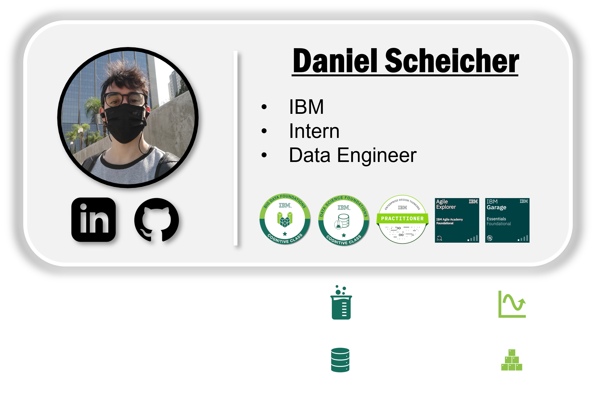

# **Learning Courses:** :books::brain:

 

### This is the ***root directory*** of **BIG DATA** studies: :mortar_board::closed_book::robot:

 

# **SUMÁRIO:** :round_pushpin:

 

- **[INTRODUÇÃO](#introdução-man_studentbooks)**

 

# **INTRODUÇÃO:** :man_student::books:
[:top: ***Voltar ao topo***](#learning-courses-booksbrain)

- ## **Formatos**:
    [:top: ***Voltar ao topo***](#robot-ibm-school-of-data-engineering)

    - Armazens de dados modernos tendem a armazenar dados em formatos:
        - "Desaclopados" (independentes) de ferramentas e abertos;
        - Binários e compactados;
        - Suportam Schema (infos de colunas e tipos armazenados no próprio dado);
        - Podem ser particionados em:
            - Redundância;
            - Paralelismo.

    - **Principais:**
        - **Parquet**: colunar, ***padrão Spark*** (mais adequado para leitura - armazem de dados é mais leitura);
        - **Apache ORC**: colunar, padrão Spark (mais adequado para leitura - armazem de dados é mais leitura);
        - **Avro**: linha (performance maior pra escrita. Muitos atributos e mais escrita - ex: banco de dados relacionais).

     

    - **Para leitura**:
        - **ORC**: mais eficiente na criação (escrita) e na compressão (precisa de menos espaço).
        - **Parquet**: melhor performance na consulta (leitura).
        - **obs**: ideal é fazer benchmark.

 

***

 

- ### **Please, be welcome to check my profile:** :nerd_face::handshake:

 

