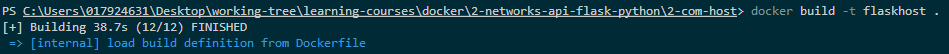

# :whale: Connect Docker container flask-python with Host mysql db

## 1. create app.py with GET and POST and configure env variables of mysql db

## 2. Build image

## 3. create database on host machine