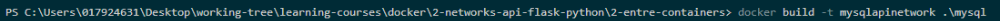
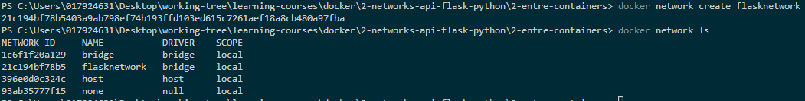
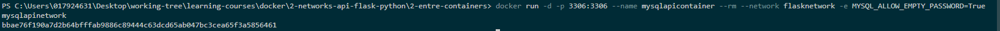

# :whale: Connection between containers

## 1. create flask/(app.py + Dockerfile) <- copied from last exercise

## 2. create mysql/(schema.sql + Dockerfile) <- copied from last exercise AND build image

## 3. create a network to connect containers

## 4. RUN mysql container (command --network)

## 5. realizar alterações no flask/app.py