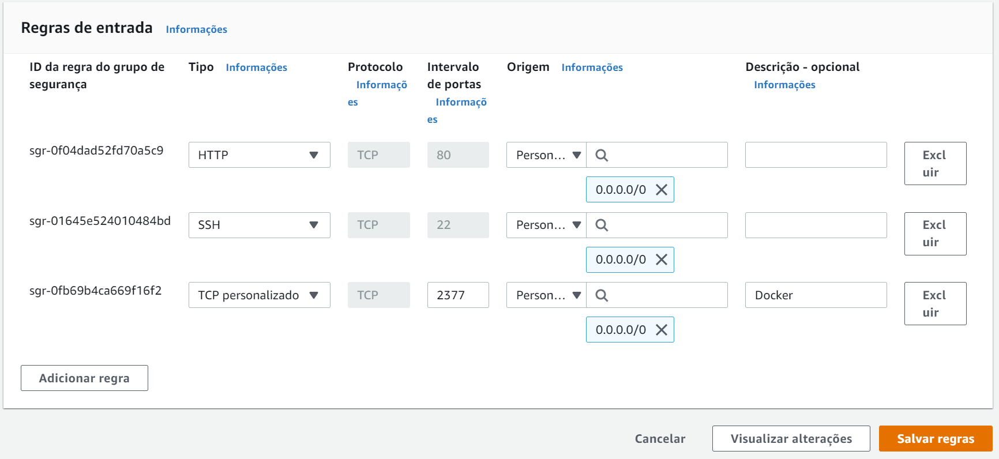
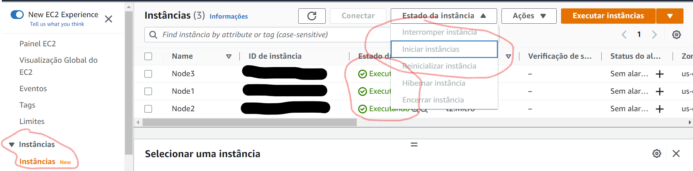
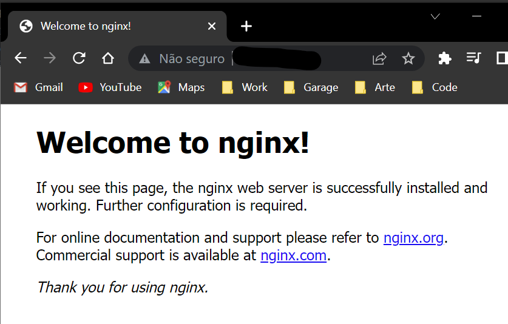

# :whale: SWARM + AWS :cloud:

***

# Sumário: :round_pushpin:

- [Resumo](#resumo-memo)
    - [Descrição](#descrição)
    - [Conceitos fundamentais](#conceitos-fundamentais)
        - [Nodes](#nodes-instância-maquina-que-participa-do-swarm)
        - [Manager node](#manager-node-que-gerencia)
        - [Service](#service-um-conjunto-de-tasks-que-o-manager-manda-o-worker-executar)
        - [Task](#task-comandos-que-são-executados-no-nodes)
     
    - [Iniciando na aws](#iniciando-na-aws)
        - [Criando instâncias](#criando-instancias)
        - [Security](#security)
        - [Iniciar instâncias](#iniciar-instâncias)
        - [Escolher Manager e executar o swarm](#escolher-manager-e-executar-o-swarm)
    - [Monitoramento](#monitoramento)
    - [Adicionando novos nodes](#adicionando-novos-nodes)
    - [Removendo nodes](#removendo-nodes)
        - [Para inativar o node](#para-inativar-o-node)
        - [Removendo totalmente](#para-remover-totalmente-inclusive-da-listagem-de-nodes)
    - [Subindo um serviço para a AWS](#subindo-um-serviço-para-o-lider-na-aws-container)
        - [Comando para subir serviço](#comando-para-subir-serviço-com-swarm)
        - [Para rodar na AWS](#para-rodar-com-a-aws)
        - [Exemplo](#exemplo)
        - [Para listar serviços](#para-listar-serviços)
        - [Para inspecionar serviços](#para-inspecionarmos-serviços)
    - [Aumentando número de réplicas](#aumentando-número-de-réplicas)
        - [Criando serviço com réplicas](#criando-serviço-com-réplicas)
        - [Atualizando número de réplicas com serviço já criado](#atualizando-número-de-réplicas-com-serviço-já-criado)


***

# Resumo: :memo:

- ## **Descrição**:
    [:top: Voltar ao topo](#whale-swarm--aws-cloud)

    - Applicações maiores com mts acessos
    - Fazer load-balance (distribuir carga)
    - Escalar varias máquinas (em cluster) para uma mesma aplicação
    - Chamada tbm de arquitetura horizontal (invez da vertical que é uma marquina gigante e cara)
    - Um serviço que rege outros serviços
    - Gerenciar e escalar

<br>

- ## **Conceitos fundamentais**:
    [:top: Voltar ao topo](#whale-swarm--aws-cloud)
    - ### Nodes: instância (maquina) que participa do swarm
    - ### Manager Node: que gerencia
    Worker Node: que trabalham em função do manager (operario)
    - ### Service: um conjunto de tasks que o manager manda o worker executar
    - ### Task: comandos que são executados no Nodes;

<br>

- ## **Iniciando na aws**:
    [:top: Voltar ao topo](#whale-swarm--aws-cloud)
    - Recomendável ir salvando IDs tokens, portas, etc em um arquivo.
    - *for more information on how swarm works, [follow](https://docs.docker.com/engine/swarm/how-swarm-mode-works/services/).*
    - ### Criando Instancias 
        - Criou-se 3 instâncias de máquina/servidor EC2 (gratuito) na [aws](https://aws.amazon.com/pt/free/?trk=2ee11bb2-bc40-4546-9852-2c4ad8e8f646&sc_channel=ps&s_kwcid=AL!4422!3!561843094929!e!!g!!aws&ef_id=Cj0KCQiAm5ycBhCXARIsAPldzoWVpnWpgfLRWybdYbj3zQMzTbcx30LdxgS2AhysjFsU2t_Hr7VvWLMaAtOIEALw_wcB:G:s&s_kwcid=AL!4422!3!561843094929!e!!g!!aws&all-free-tier.sort-by=item.additionalFields.SortRank&all-free-tier.sort-order=asc&awsf.Free%20Tier%20Types=*all&awsf.Free%20Tier%20Categories=*all).
    - ### Security:
        - Baixar chave
        - Posicionar arquivo de chave na ***pasta .ssh*** e alterar permissão de grupos de usuários para a pasta/arquivo
        - alterar: ***security group*** -> clicar no id do servidor -> editar regras de entrada -> configurar conforme imagem a baixo.
        
    - ### Iniciar instâncias:

        - (mudar para estado 'executando'; 'Estado de insância'; conforme imagem a baixo)
        
    - ### Escolher ***Manager*** e executar o swarm:
        - Clickar no ID da instância -> clickar em Conectar -> seguir instruções..
        - Quando o servidor estiver rodando execute:
            - ```$ docker ps```
                - Caso não tenha o docker instalado:
                    - ```$ sudo yum update -y ```
                    - ```$ sudo yum install docker```
                    - ```$ sudo service docker start```
                    - Conceder usuário no docker:
                        - ```$ sudo usermod -a -G docker ec2-user```
                - Caso já tenha, pular para os próximos passos..
            - ```$ docker swarm init```
                - copiar o ***token*** que aparecerá para realizar os joins dos workers (máquinas que irá conectar)
            
            - Para sair (manager precisa do -f e workers não; não é excluído, porém seu status fica como down -> inativo):
                - ```$ sudo docker swarm leave -f```
                - Para remover totalmente (inclusive da listagem de nodes):
                    - ```docker node rm <ID>```
        - Algumas vezes será necessário declarar o IP do servidor com a tag ***--advertise-addr***
        - Fará com que a instância/máquina vire um ***node***
        - Tranfsorma o Node em um ***Manager***

<br>

- ## **Monitoramento**:
    [:top: Voltar ao topo](#whale-swarm--aws-cloud)
    - ```$ docker node ls```
    - Serviços serão exibidos no terminal

<br>

- ## **Adicionando novos Nodes**:
    [:top: Voltar ao topo](#whale-swarm--aws-cloud)
    - ```$ docker swarm join --token <token><IP>:<PORTA>```
    - Desta forma duas máquinas estarão conectadas.
    - Esta nova máquina entra na hierarquia como ***Worker***.
    - Todas as ações (***tasks***) utilizadas na Manager, serão ***replicadas*** em Nodes que foram adicionados com join.

<br>

- ## **Removendo nodes**:
    [:top: Voltar ao topo](#whale-swarm--aws-cloud)
    - ### Para inativar o node:
        - ```$ sudo docker swarm leave```
    - ### Para remover totalmente (inclusive da listagem de nodes):
        - ```docker node rm <ID>```

<br>

- ## **Subindo um serviço para o lider na AWS (container)**:
    [:top: Voltar ao topo](#whale-swarm--aws-cloud)
    - *for more information on how services on docker works, [follow](https://docs.docker.com/engine/reference/commandline/service/).*
    - ### Comando para subir serviço com swarm:
        - $ ```docker service create --name <nome><imagem>```
    - Com o exemplo do nginx, é necessário liberar a porta 80 na aws (já realizado).
    - ### Para rodar com a aws:
        - Será necessário fazer o docker swarm init com a tag '--advertise-addr <numero-ip>' (ip do servidor se encontra em 'instancias' -> seleciona servidor -> 'Endereço IPV4 público').
        - Caso já tenha inicializado o init sem a tag, refaça!
     - ### Exemplo:
     - *for more information about nginx on docker, [follow](https://hub.docker.com/_/nginx)*.
        - ```$ sudo docker service create --name nginxswarm -p 80:80 nginx```
        - inicialmente, não está sendo escalada.
        
        - Serviço inicializado pelo swarm
    - ### Para listar serviços:
        - ```$ docker service ls```
    - ### Para inspecionarmos serviços:
        - ```docker service inspect <ID>```
    - ***Obs***: node é a maquina que estamos rodando com o swarm e service é o projeto que estamos rodando. só que não obrigatoriamente tem-se um projeto rodando que é necessário que estejam rodando todas as máquinas com swarm. então é bom saber separar as coisas pra saber o que está rodando como serviço e como está rodando como node. 
        - ```$ node ls``` -> máquinas conectadas
        - ```$ service ls``` -> projetos rodando
    - Remover serviços:
        - ```$ docker service rm <nome>```

<br>

- ## **Aumentando número de réplicas**:
    [:top: Voltar ao topo](#whale-swarm--aws-cloud)
    - ### Criando serviço com réplicas:
        - ```$ docker service create --name <nome> --replicas <numero> <imagem>```
        - Desta maneira uma task será emitida, replicando este serviço nos workers
        - Agora inicia-se, de fato, a orquestração.
        - Pode-se checar o status com:
            - ```$ docker service ls```
    - ### Atualizando número de réplicas com serviço já criado:
        - ```$ docker service update --replicas 3```
        - Pode-se checar o status com:
            - ```$ docker service ls```
    - Pode-se verificar, também, containers rodando nos outros nodes com o ```$ docker ps```.
    
<br>

- ## Copiando arquivos para a instância na AWS:
    [:top: Voltar ao topo](#whale-swarm--aws-cloud)
- *for more information about sftp communication using ssh, [follow](https://www.ssh.com/academy/ssh/sftp)*

    - Usando comando scp (secure copy):
        - ```$ scp -i "~/.ssh/aws-key.pem" "index.html" ec2-user@ec2-3-89-27-181.compute-1.amazonaws.com:~/```


***

- ## **Section 8, a partir 134:**
    [:top: Voltar ao topo](#whale-swarm--aws-cloud)
- Reação do Swarm quando se remove um container de um worker:
    - Quando um container é removido do node worker, o docker reinicia este container novamente por conta do serviço ainda estar rodando no Manager (isto é uma de suas atribuições, garantir que os serviços estejam sempre disponíveis).
    - É necessário utilizar o force (-f).

- OBS: A conexão SSH com os servidores da AWS, caem conforme um certo tempo. Para que nossa conexão mantenha a conexão, através de um ping enviado a cada constante de tempo, podemos configurar o arquivo config da pasta .ssh/:
    - ```vim home/{user}/.ssh/config```
    - Escreva:
        - ServerAliveInterval 3600 
            - onde 3600 é o intervalo de tempo
    