# :whale: **SWARM + AWS** :cloud:

<br>

# **Sumário:** :round_pushpin:

- [Resumo](#resumo-memo)
    - [Descrição](#descrição)
    - [Conceitos fundamentais](#conceitos-fundamentais)
- [Infra]()
    - [Minikube](#minikube)
- [Gestão de containers]()
    - [Kubernetes modo imperativo](#kubernetes-modo-imperativo)
        1. [Deployment](#deployment)
        2. [Services](#services)
        3. [Replicando nossa aplicação](#replicando-nossa-aplicação)
        4. [Atualizando a imadem do projeto](#atualizando-a-imagem-do-projeto)
        5. [Fazer rollback do projeto](#fazer-rollback-do-projeto)
        6. [Deletar serviço](#deletar-serviço)
        7. [Deletar deployment](#deletar-deployment)
    - [Kubernetes modo declarativo](#kubernetes-modo-declarativo)

<br><br>

# **Resumo:** :memo:

- ## **Descrição**:
    [:top: Voltar ao topo](#whale-swarm--aws-cloud)

    - Applicações maiores com mts acessos
    - Fazer load-balance (distribuir carga)
    - Escalar varias máquinas (em cluster) para uma mesma aplicação
    - Chamada tbm de arquitetura horizontal (invez da vertical que é uma marquina gigante e cara)
    - Um serviço que rege outros serviços
    - Gerenciar e escalar

<br>

- ## **Conceitos fundamentais**:
    [:top: Voltar ao topo](#whale-swarm--aws-cloud)
    - ***Control Plane***: Onde ocorre o gerenciamento dos processos dos nodes.
    - ***Nodes***: máquinas que são gerenciadas pelo Control Plane.
    - ***Pod***: um ou mais containers que estão em um Node.
    - ***Deployment***: a execução de uma imagem/projeto em um Pod.
    - ***Services***: serviços que expõe os Pods ao mundo externo.
    - ***kubectl***: cliente de linha de comando para o Kubernetes.

<br><br>

# **Infra:**

- ## **Minikube**:
    [:top: Voltar ao topo](#whale-swarm--aws-cloud)
    - Minikube quickly sets up a local Kubernetes cluster on macOS, Linux, and Windows.
        - To check documentation and more infos, [follow](https://minikube.sigs.k8s.io/docs/).
    - Inicializar com o comando: ```$ minikube start --driver=<DRIVER>```
        - Driver exemplos: ***virtualbox, hyperv e docker***.
        - Quando nosso pc é reiniciado, o minikube para de funcionar automaticamente.
    - Para checar status: ```$ minikube status```
    - Parando com o comando: ```$ minikube stop```
    - Dashboard do minikube com o comando: ```$ minikube dashboard```
        - Para recuperar apenas o link: ```$ minikube dashboard --url```

<br><br>

# **Gestão de Containers:**

- ## **Kubernetes modo Imperativo**:
    [:top: Voltar ao topo](#whale-swarm--aws-cloud)
    - Kubernetes is an open source container orchestration engine for automating deployment, scaling, and management of containerized applications. The open source project is hosted by the Cloud Native Computing Foundation (CNCF).
        - To check documentation and more infos, [follow](https://kubernetes.io/docs/home/).
    
    1. ### **Deployment**:
        [:top: Voltar ao topo](#whale-swarm--aws-cloud)

        - Criação de Pods, definindo uma imagem e um nome, para, posteriormente, ser replicado entre os servidores.
        - É preciso que a imagem esteja no Hub do Docker, para gerar um Deployment.
        - **Exemplo:** <br>
            ***Python com Flask, Dockerfile e index.html:***
            - Faz o build da imagem (Dockerfile)
                - ```$ docker build -t <NOME-USUARIO>/flask-kubernetes-projeto .```
            - Faz o push da imagem para o HUB 
            - Roda um container de teste:
                - ```$ docker run -d -p 5000:5000 --name flask-hub --rm <NOME-USUARIO>/flask-kubernetes-projeto```
        1. **Criar** um Deployment:
            - ```$ kubectl create deployment <NOME> --image=<IMAGEM>```
            - Exemplo: ```$ kubectl create deployment flask-deployment --image=purple_nose/flask-kub-projeto```
                - Caso houver falhas, tente startar novamente o minikube: ```$ minikube start```
        2. **Checar** Deployments: 
            1. Listar: ```$ kubectl get deployments```
            2. Configurações: ```$ kubectl describe deployments```
        
        3. **Checar** Pods:
            1. Listar: ```$ kubectl get pods```
            2. Configurações: ```$ kubectl describe pods```

        4. **Checar** Kubernetes configs:
            - ```$ kubectl config view```
            - Receberemos informações importantes baseadas no Minikube, que é por onde o Kubernetes está sendo executado.

    <br>
            
    2. ### **Services**:
        [:top: Voltar ao topo](#whale-swarm--aws-cloud)

        - As aplicações do Kubernetes não tem conexão com o mundo externo, por isso precisamos criar um Service que é o que possibilita expor os Pods.
        - Os Pods são criados para serem destruídos (efêmeros) e perderem tudo, ou seja, os dados ferados neles serão apagados. Portanto, um Service é uma entidade separada dos Pods que expõe eles à uma rede.

        1. **Criar um Service (expor deploy ao externo):**
            - ```$ kubectl expose deployment <NOME> --type=<TIPO> --port=<PORT>```
                - Colocaqueremos o mesmo nome do Deployment já criado.
                - Existem vários ***tipo de Service***, porém o ***LoadBalancer*** é o mais comum, no qual todos os Pods são expostos.
                - A porta deve fazer conexão com a porta criada em nosso container (app.py e Dockerfile).
        2. **Gerar IP de acesso:**
            - ```$ minikube service <NOME>```
            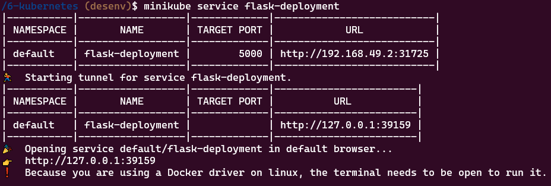
            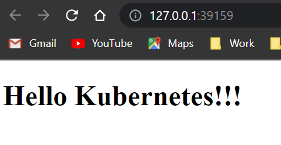
        3. **Verificando nossos Services:**
            - Todos: ```$ kubectl get services```
            - Específico: ```$ kubectl describe services/<NOME>```

    <br>


    3. ### **Replicando nossa aplicação:**
        [:top: Voltar ao topo](#whale-swarm--aws-cloud)

        1. **Utilizando outros Pods:**
            - ```$ kubectl scale deployment/<NOME-DEPLOYMENT> --replicas=<NUMERO>```
                - Funciona tanto para aumentar quanto para diminuir número de Pods (para diminuir basta NUMERO < número-atual-de-pods).
        2. **Analise de escalabilidade:**
            - Podemos ver no ***dashboard***;
            - Podemos ver com o ***comando***: ```$ kubectl get pods```
        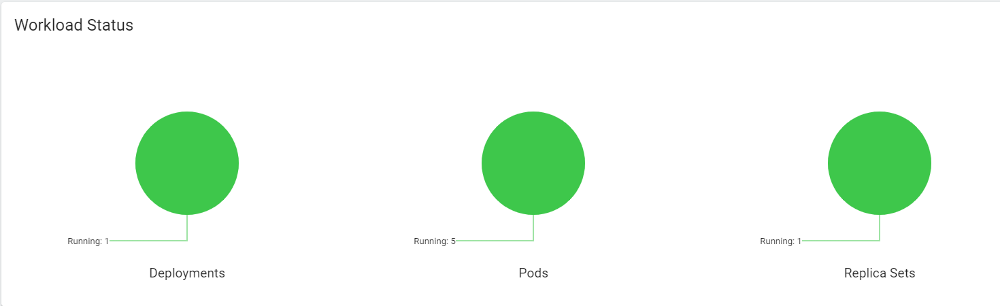
        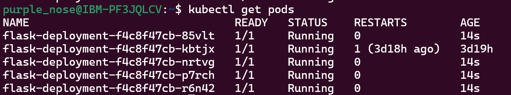
        
        3. **Listando número de Replicas para diferentes serviços:**
            - ```$ kubectl get rs```

    <br>


    4. ### **Atualizando a imagem do projeto**:
        [:top: Voltar ao topo](#whale-swarm--aws-cloud)

        - Será necessário ***nome do container*** (dado na dashboard e no ```$ kubectl get pods```).
        - A nova imagem deverá ter outra versão (será necessário subir nova tag para o Hub).
        - Comando: ```$ kubectl set image deployment/<NOME> <NOME_CONTAINER>=<NOVA_IMAGEM>```
        1. Atualizando arquivo (no exemplo o index.html):
            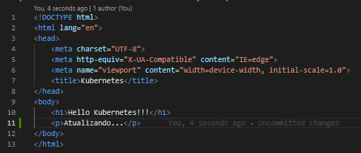
        2. Re-buildando imagem:
            - ```$ docker build -t danielschei/flask-hubernetes-projeto:2 .```
        3. Realizando o push para o hub:
            - ```$ docker push danielschei/flask-kubernetes-projeto:2 .```
        4. Realizando atualização:
            - Encontrar o ***Pod Manager*** (criado antes das replicas).
                - Dashboard > clicar pods (abrir pagina) > scroll down até categoria "Containers" > copiar nome.
            - ```$ kubectl set image deployment/flask-deployment  flask-kubernetes-projeto=danielschei/ flask-kubernetes-projeto:2```
            - irá atualizar os pods

                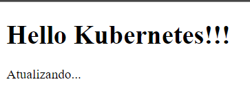

    <br>


    5. ### **Fazer Rollback do projeto**:
        [:top: Voltar ao topo](#whale-swarm--aws-cloud)
        - **Comando para verificar alteração (atualização):**
            - ```$ kubectl rollout status deployment/<NOME>```
            - Conseguimos ver se subimos imagem com nome errado, tag errada, etc.
            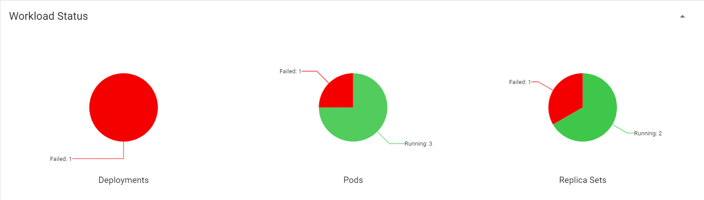

        - **Comando para realizar o rollback:**
            - ```$ kubectl rollout undo deployment/<NOME>```
            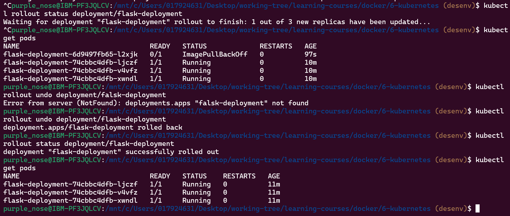
            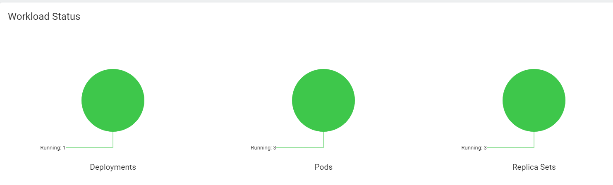

    <br>


    6. ### **Deletar Serviço**:
        [:top: Voltar ao topo](#whale-swarm--aws-cloud)

        - ```$ kubectl delete service <NOME>```
        - Removerá conexão externa (não poderemos mais acessar), pois não teremos mais o serviço disponível (mesmo com os pods rodando normalmente).
        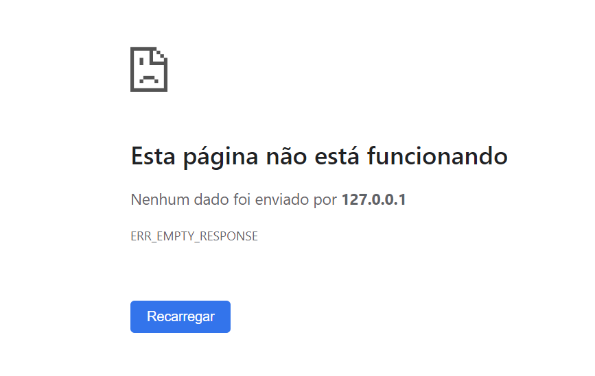

    <br>


    7. ### **Deletar Deployment**
        [:top: Voltar ao topo](#whale-swarm--aws-cloud)

        - ```$ kubectl delete deployment <NOME>```
        - Paramos os Pods e Containers.
        - Dessa forma, teremos que criar outro deployment com mesma ou outra imagem para acessar algum projeto.
        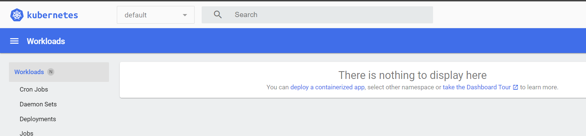

    <br>

- ## **Kubernetes modo Declarativo**:
    [:top: Voltar ao topo](#whale-swarm--aws-cloud)
    - Escrito em YAML.
    - Para projetos mais complexos.
    1. ### **Chaves mais utilizadas para criar o arquivo YAML:**
        - **apiVersion**: versão utilizada pela ferramenta;
        - **kind**: tipo do arquivo (Deployment, Service);
        - **metadata**: descrever algum objeto, inserindo chaves como 'name';
        - **replicas**: número de réplicas de Nodes/Pods;
        - **containers**: definir especificações de containers como: nome e imagem.

    <br>
    
    2. ### **Criando um Deployment:**
        [:top: Voltar ao topo](#whale-swarm--aws-cloud)
        Kind = Deployment.
        1. ### Executando:
            - ```$ kubectl apply -f <ARQUIVO>```
            - Temos que estar localizados (prompt) na pasta onde se encontra o arquivo YAML.
        
        2. ### Parando o Deployment:
            - ```$ kubectl delete -f <ARQUIVO>```

    <br>
    
    3. ### **Criando um Service:**
        [:top: Voltar ao topo](#whale-swarm--aws-cloud)
        Kind = Service.
        1. ### Executando:
            - ```$ kubectl apply -f <ARQUIVO>```
            - Temos que estar localizados (prompt) na pasta onde se encontra o arquivo YAML.

        2. ### Necessário gerar o IP de acesso no Minikube:
            - ```$ minkube service <NOME>```

        

        3. ### Deletando serviço:
            - ```$ kubectl delete -f <ARQUIVO>```
            - Perde-se o acesso ao projeto.

    <br>
        
    4. ### **Atualizando um projeto:**
        [:top: Voltar ao topo](#whale-swarm--aws-cloud)
        1. Criar nova versão de Imagem;
        2. Realizar push;
        3. Altera no arquivo YAML de Deployment a tag no seletor 'image:';

        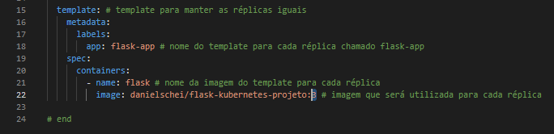

        4. Reaplicar o comando de apply para o arquivo de Deployment.
    
    <br>

    5. ### **Unindo Deployment e Service em um arquivo só:**
        [:top: Voltar ao topo](#whale-swarm--aws-cloud)
        - A separação de objetos para o YAML é com: ---
        - Uma boa prática é colocar o service antes do deployment
        1. ### Executando:
            - ```$ kubectl apply -f <ARQUIVO>```
            - Temos que estar localizados (prompt) na pasta onde se encontra o arquivo YAML.

            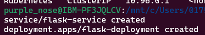

            2. ### Necessário gerar o IP de acesso no Minikube:
            - ```$ minkube service <NOME>```
            
            