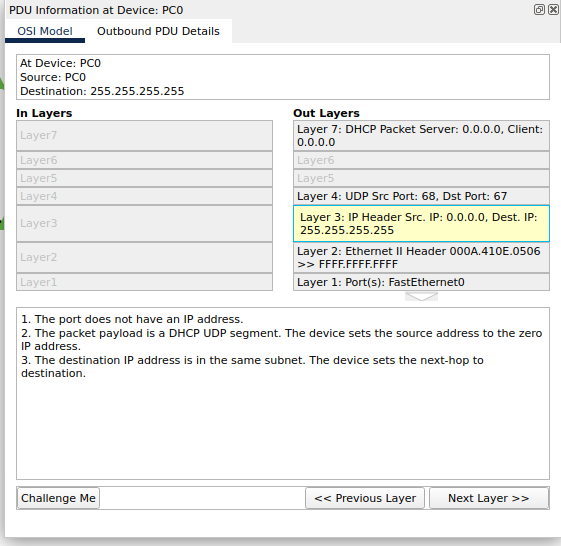
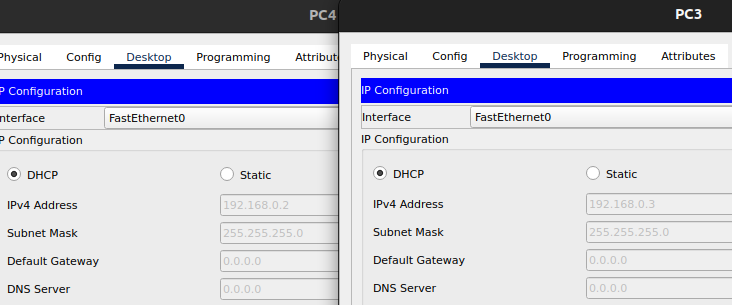

# **FATEC - SP :teacher:**
## **LABORATÓRIO DE REDES :globe_with_meridians:**

***

## **SUMÁRIO :pushpin:**

- **TEORIA:**
    1. [INSTALAÇÃO DE SERVIÇO DE DHCP](#instalação-de-serviço-de-dhcp-round_pushpin)
    2. [CONTEXTUALIZANDO UM SERVIÇO DHCP](#contextualizando-um-serviço-dhcp-round_pushpin)
    3. [DEFINIÇÃO: DCHP](#definição-dchp---dynamic-host-configuration-protocol-round_pushpin)
    4. [COMO OPERA](#modus-operandi-como-é-feito-round_pushpin)
    5. [FORMAS DE ATRIBUIÇÃO DE REDES](#diferentes-formas-de-atribuição-de-redes-round_pushpin)

- **PRATICA:**
    1. [PACKET TRACER](#packet-tracer-round_pushpin)

***

## **INSTALAÇÃO DE SERVIÇO DE DHCP :incoming_envelope:**

### Entendendo Endereço IP :round_pushpin:
**[back to top](#fatec---sp-teacher) :point_left: :top:**

- A internet é uma rede que providencia o trafego de dados. Para que um transmissão ocorra, precisamos, no mínimo, de um emisso e um receptor.

- Em um cenário de muitos emissores e receptores, é necessário o endereçamento destes, para que a informação não se perca.

- A Internet precisa de um meio de distinguir diferentes computadores, roteadores e sites. O endereço IP providencia isso.

- Um Endereço de Protocolo da Internet, do inglês Internet Protocol address, é um rótulo numérico atribuído a cada dispositivo conectado a uma rede de computadores que utiliza o Protocolo de Internet para comunicação.
    - "Internet Protocol" (protocolo de rede), consiste em um conjunto de regras que regem o formato de dados enviados pela Internet ou por uma rede local.

- Endereço IP é um endereço exclusivo que identifica um dispositivo na Internet ou em uma rede local.

- O endereço IP é representado por um conjunto de quatro números, variando de 0 a 255 e separados por pontos.
    - Entre 0.0.0.0 e 255.255.255.255.

- Aqui vale sempre ressaltar que essa conversa utiliza convenções, métodos e regras. Portanto, necessita de orgãos de poder de decisão, para que tudo seja muito bem organizado e endereçado corretamente (dois lugares não tenham o mesmo endereço ou um lugar não tenha 2 endereços diferentes).
    - Os endereços IPs são matematicamente gerados e atribuidos pela IANA, um departamento da ICANN.
    - Toda vez que alguém registra um domínio na Internet, ele passa por um registrador de nomes de domínio, que paga uma pequena taxa para a ICANN registrar o domínio.

### Contextualizando um serviço DHCP :round_pushpin:
**[back to top](#fatec---sp-teacher) :point_left: :top:**

- Quando se fala de redes e endereçamento, fica muito fácil usar a comparação com CEP.

- Sabendo que cada residência, comercio e etc. tenha um CEP (um endereço), já pré-estabelecido por um orgão centralizador que gerencia tudo isso, podemos fazer a seguinte comparação:
    - Vamos supor que um novo condomínio é criado e este recebe um CEP, um endereço.
    - Depois de construído, percebe-se que existem várias casas, com diferentes moradores.
    - Ao chegarem encomendas, cartas e outras coisas (vamos chamar de pacote) para cada morador, qual seria a melhor maneira de distribuir cada pacote para seu respectivo dono?
     - Supondo que cada pacote tenha como informação o endereço, tendo que ser identificado por este e seu conteúdo.
    - Uma maneira seria receber todos esses pacotes no endereço do condomínio e cada morador ir até a portaria, abrir o pacote e ver se este o pertence ou não. Porém, já dá para notar quanta congusão isso iria causar.
    - Outra maneira, seria criar um processo para atribuir um outro nível de endereço para cada casa dentro do condomínio, o que vamos chamar de endereço local. Sendo assim, fica muito mais fácil de, apenas pelo endereço do pacote, saber de quem é dono.
    - A mesma coisa funciona para uma rede local. O serviço de DHCP (processo de atribuição de endereçamento local) funciona para distribuir endereços para cada máquina, só que de forma automática e dinâmica (vamos entender melhor essas questões).

### Definição: DCHP - Dynamic Host Configuration Protocol :round_pushpin:
**[back to top](#fatec---sp-teacher) :point_left: :top:**

- DHCP em português: algo como, Protocolo de Configuração **Dinâmica** de Endereços de Rede.
-Digamos que você seja o administrador de uma rede. Se fosse uma rede doméstica com 3 computadores, não seria trabalhoso atribuir um número de IP e todos os parâmetros necessários para cada um deles. Agora, se fossem 100, 200 ou mais, certamente a história seria outra.

- O protocolo DHCP, por meio dele um servidor, é capaz de distribuir automaticamente endereços de IP diferentes a todos os computadores à medida que eles fazem a solicitação de conexão com a rede. Essa distribuição dos IPs é feita em um intervalo pré-definido configurado no servidor. Sempre que uma das máquinas for desconectada o IP ficará livre para o uso em outra.

### Modus Operandi (como é feito?) :round_pushpin:
**[back to top](#fatec---sp-teacher) :point_left: :top:**

1. Descoberta DHCP: o cliente transmite mensagens para descobrir os servidores com mesmo protocolo. O computador cliente envia um pacote com o destino de difusão padrão (255.255.255.255). Este é um endereço de transmissão especial, que significa “esta rede” e permite que seja enviado um pacote de transmissão à rede à qual está conectado;

2. Oferta DHCP: quando o servidor recebe a mensagem DHCP para descoberta, sugere ou oferece um endereço IP ao cliente. A mensagem de oferta contém o endereço IP proposto para o cliente, endereço IP do servidor, endereço MAC do cliente, máscara de sub rede, gateway padrão, endereço DNS e informações de concessão;

3. Requisição: o cliente pode receber várias ofertas de DHCP porque em uma rede existem muitos servidores com o protocolo – devido à tolerância de falhas. Se o endereçamento IP de um servidor falhar, outros servidores podem fornecer backup. Mas, o cliente aceitará apenas uma oferta de DHCP;

4. Confirmação: na parte final, o servidor envia uma confirmação para o cliente, garantindo a concessão de DHCP para o cliente. O servidor pode enviar qualquer outra configuração que o cliente possa ter solicitado. Nesta etapa, a configuração de IP é concluída e o cliente pode usar as novas configurações de IP.

### Diferentes Formas de atribuição de Redes :round_pushpin:
**[back to top](#fatec---sp-teacher) 	:point_left: :top:**

- Configuração Automática
    - uma quantidade de endereços de IP (dentro de uma faixa) é definida para ser utilizada na rede. Neste caso, sempre que um dos computadores de uma rede solicitar a conexão com ela, um destes IPs será designado para a máquina em questão.

- Configuração Dinâmica
    - o procedimento é bem parecido com o efetuado pela automática, porém a conexão do computador com determinado IP é limitada por um período de tempo pré-configurado que pode variar conforme desejado pelo administrador da rede.

- Configuração Manual
    - o DHCP aloca um endereço de IP conforme o valor de MAC (Medium Access Control) de cada placa de rede de forma que cada computador utilizará apenas este endereço de IP. Utiliza-se este recurso quando é necessário que uma máquina possua um endereço de IP fixo.

### Packet Tracer :round_pushpin:
**[back to top](#fatec---sp-teacher) :point_left: :top:**

- Para o acompanhamento será referenciado o mapa de navegação que se encontra no [README.md principal de ./redes.](./../README.md)

#### **O que será utilizado:**

  - **1x Switch**
    - Barra de Navegação Inferior:
        - Segunda Linha:
            - Primeira Coluna: 
                - Primeira Linha: Network Devices
                - Segunda Linha: Switches
            - Segunda Coluna: 2960 IOS15

  - **5x PCs**
    - Barra de Navegação Inferior:
        - Segunda Linha:
            - Primeira Coluna: 
                - Primeira Linha: End Devices
                - Segunda Linha: End Devices
            - Segunda Coluna: PC-PT

  - **1x Servidor**
    - Barra de Navegação Inferior:
        - Segunda Linha:
            - Primeira Coluna: 
                - Primeira Linha: End Devices
                - Segunda Linha: End Devices
            - Segunda Coluna: Server-PT

  - **Nx Conexões**
    - Barra de Navegação Inferior:
        - Segunda Linha:
            - Primeira Coluna: 
                - Primeira Linha: Connections
                - Segunda Linha: Connections
            - Segunda Coluna: Automatically Choose Connection Type

#### **Configuração:**

1. **Inserir PC na área de trabalho:**
    1. Clicar no ícone do PC e em seguida clicar no espaço em branco da tela do programa, depositando o PC nela. (Repetir para cada PC - mais 4 vezes)
        - Também pode-se utilizar a técnica drag-and-drop (clicar e arrastar para tela).

        

2. **Inserir Switch na Área de Trabalho:**
    1. Fazer a mesma coisa para o Switch

        

3. **Criar conexões entre Switch e Pcs:**
    1. Clicar na conexão -> Clicar no Switch -> Clicar em um PC.
    2. Repetir 3.1 para os demais PCs.

4. **Requisitar IP para PC sem serviço DHCP habilitado:**
    1. Em modo Real Time (Barra de Navegação Inferior, Primeira Linha, Segunda Coluna)
    2. Dar 2 cliques em cima de qualquer PC conectado ao Switch
        - Um pop-up será aberto:

        

    3. Clique na aba (superior) "Desktop" -> clique no primeiro ícone "IP Configuration"

    4. Selecione o botão DHCP
        - Um texto aparecerá dizendo que está requisitando o serviço
        - Mesmo podendo ver um endereço aleatório cadastrado, aparecerá uma mensagem dizendo que o serviço falhou
    
    5. Fechar o pop-up

5. **Fazer a mesma coisa do passo 1 e 2 para o alocar o Servidor na área de trabalho.**

6. **Criar IP para servidor manualmente:**
    1. Clicando em cima do Servidor na área de trabalho, iremos seguir os mesmos passos de 4.1 até 4.3 -> Selecionar "Static" -> Atribuir um IP e Subnet Mask
    - O Servidor de DHCP será o primeiro IP da nossa rede local.
    - A Subnet Mask costuma ser setada 255.255.255.0 automaticamente.
        - Máscara tipo C /24 (iniciam endereçamento no vigésimo quinto bit e terminam no trigésimo primeiro)

    

7. **Criar Serviço de DHCP:**
    1. Clicar em cima do servidor na area de trabalho -> Clicar na aba (superior) "Services" -> Clicar na aba lateral "DHCP"
    2. Habilitar como "on" o "Service"
    3. Setar Ip inicial "Start IP Address" (a partir de qual endereço será usado para setar IPs automa/dinamicamente)
        - Sugere com final 0, diferente do nosso (final 1)
            - Não podemos setar o mesmo IP que nossa máquina
        - Iniciaremos no 10 
            - Deixar uma sobra caso se queira futuramente acrescentar mais servidores entre o 0 e 9
    2. Setar mascara de rede "Subnet Mask" 
        - padrão vem como: C /24
    3. Setar número máximo de usuários "Maximum Number of Users"
        - Classe C permite 255 alocações.
        - Alocação .1 é do nosso Servidor, alocações de 2 a 9 são para outros servidores (caso queiramos futuramente), 255 é para broadcast (identificação com o serviço de DHCP) -> sobra 245
        - Deixaremos 200, para uma margem de segurança.
    5. Salvar

    

8. **Criar conexões entre Switch e Servidor seguindo passo 3.1**

    

9. **Criar Simulação:**
    1. Clicar em "Simulation" (Aba de navegação inferior, primeira linha, segunda coluna) -> Editar Filtros ("edit filters") -> na aba superior de IPv4 deixar selecionado apenas o DHCP

        

7. **Configuração IP para os PCs com serviço DHCP habilitado:**
    1. Seguir passo 4.2 ao 4.4
    2. Ao clicar em DHCP aparecerá na tela um ícone de carta de correio em cima do PC selecionado, representando nosso pacote.

        

    3. Clicando no Ícone do nosso pacote, no pop-up que irá abrir, podemos notar que em "Out Layers", Layer 3, nós não temos um IP base (Src.) e estamos enviando o pacote em mode de Broadcast (para todos).

        

    4. Clicar na Barra de navegação Lateral na linha de Play Control, para seguir um passo a diante.

        

    5. Será visualizado a mensagem sendo encaminhada ao Switch.

    6. Clicar na Barra de navegação Lateral na linha de Play Control, para seguir um passo a diante.

    7. A mensagem será encaminhada a todas as conexões do Switch, mas apenas o pacote encaminhado ao Servidor ficará com um ícone de sucesso.

        

    8. Clicar na Barra de navegação Lateral na linha de Play Control, para seguir um passo a diante.

    9. O servidor irá retornar o pacote ao Switch

    10. Clicar na Barra de navegação Lateral na linha de Play Control, para seguir um passo a diante.

    11. O Switch encaminhará o pacote para todas as conexões mas apenas será lida pelo PC que enviamos o pacote de requisição de IP.

    12. Ao analisarmos a camada 3 e 7, tanto de In Layer (recebimento) quanto de Out Layers, verificaremos que o pacote foi recebido por conta do endereço IP ser de broadcast, que é um pacote de oferta, o cliente desconstroi e constroi um pacote de envio ao servidor novamente e seta seu IP para o 0 endereço IP.

    13. Clicar na Barra de navegação Lateral na linha de Play Control, para seguir um passo a diante.

    14. Veremos o pacote partindo do PC ao Switch novamente.

    15. Clicar na Barra de navegação Lateral na linha de Play Control, para seguir um passo a diante.

    16. O Switch irá transmitir o pacote a todas as conexões (broadcast)
        1. Apenas o Servidor irá ler
        2. Ao analisarmos o pacote, Out Layer, Camada 3, poderemos ver um endereço IP enviado para ser setado.

    18. Clicar na Barra de navegação Lateral na linha de Play Control, para seguir um passo a diante.

    19. O pacote será reenviado para o Switch

    20. Clicar na Barra de navegação Lateral na linha de Play Control, para seguir um passo a diante.

    21. O pacote será enviado do Switch a todas as conexões mas apenas o PC que queremos poderá le⁻lo.
        1. Ao analisarmos o pacote iremos verificar em In Layer, camada 7, que o cliente (PC) recebeu e setou o IP que o Servidor enviou.
        2. Ao verificarmos o IP da máquina, iremos ver o IP setado.

            

8. R**epitir etapas do item 7 que achar necessário para os demais PCs**

    