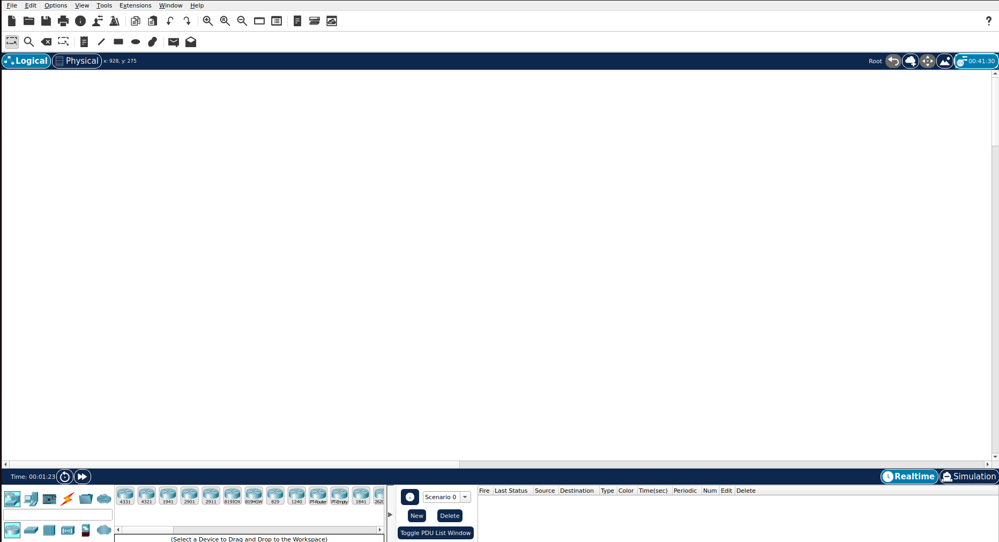
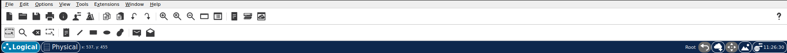
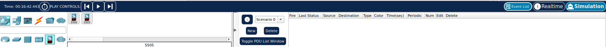

# **FATEC - SP :teacher:**
## **LABORATÓRIO DE REDES :globe_with_meridians:**

## **SUMÁRIO :pushpin:**

1. [DHCP](./1-dchp/)

2. HTTP (sem DNS)

3. DNS

4. HTTP (com DNS)

5. E-mail (POP + SMTP)

6. ACCESS POINT

***

## Packet Tracer - Mapa de Navegação :round_pushpin:
**[back to top](#fatec---sp-teacher) :point_left: :top:**

- Pode ser divido, principalmente em:
    - Barra de navegação Superior:

        

        1. Primeira Linha: ações do programa
        2. Segunda Linha: Atalhos de ações do programa
        3. Terceira Linha: Modos de edição do programa
        4. Quarta linha:
            1. Primeira Coluna: Escolher entre Modelo Logico ou Físico.
            2. Segunda COluna: Definições

    - Barra de navegação Inferior:

        

        1. Primeira Linha:
            1. Primeira Coluna: Tempo e ações de tempo
            2. Segunda Coluna: Escolher entre modos Realtime e Simulation
        2. Segunda linha:
            1. Primeira Coluna: 
                1. Primeira Linha: Escolha de Componentes
                2. Segunda Linha: Descrição do Mouse Over (descrição do objeto que o mouse estiver passando por cima)
                3. Terceira Linha: Escolha de Tipos, referente ao Componente escolhido na primeira Linha.
            2. Segunda Coluna:
                1. Primeira Linha: Escolha de Objeto, referente ao Tipo e Componente.
                2. Segunda Linha: Descrição do Objeto com Mouse Over (descrição do objeto que o mouse estiver passando por cima).
            3. Terceira Coluna: Definição, configuração e ações de diferentes cenários.
    
    - Barra de Navegação Lateral Direita: 
    
        

        - Aparecerá ao clicar em "Simulação" na Barra de navegação Inferior, primeira linha, segunda coluna
        - Nela será possível executar simulação (passo-a-passo se quiser também), configurar e editar filtros e acompanhar.