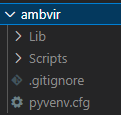

# **Learning Courses:**

## Ambiente Virtual para Python :package::shield:

<br>

# Sumário: :pushpin:

- [Introdução](#introdução-page_facing_uppencil2)
- [Implementação](#implementação-wrench)

<br>

# Introdução: :page_facing_up::pencil2:
[:top: ***Voltar ao topo***](#learning-courses)

Todo servidor é como se fosse sua máquina, só que não rs.

O que quero dizer com isso?

Quando você constroi um projeto, utiliza bibliotecas, extensões e etc., cada um com a sua versão, e tenta colocar em produção (em um servidor que estará rodando sua aplicação 24hrs por dia), o que pode acontecer caso esse computador tenha versões diferentes das bibliotecas que você implementou no seu código?

Ou se você entra em um projeto de software já existente e precisa implementar novas features que usam bibliotecas com versões diferentes das da sua máquina?

Vamos supor que você esteja em mais de um projeto. Como fazer essa gestão de versões, se cada projeto utilizar uma versão diferente?

***Uma solução para estes problemas*** é o **ambiente virtual**, ou seja, um ambiente isolado do seu sistema operacional raiz e das pastas raízes de linguagens utilizadas (onde normalmente se encontram as bibliotecas baixadas no seu pc), que reunirá todas as bibliotecas, extensões e etc. específicos para seu projeto e que, quando você realizar testes (rodar o código) na sua máquina, ela irá utilizar as versões que se encontram nesse ambiente virtual, não fazendo confusão com outras versões instaladas na sua máquina.

Além disso, essa solução têm algumas funções que facilitam o deploy em produção. Ou seja, caso você necessite subir a aplicação da sua máquina, rodando as versões de bibliotecas que estão funcionando sem ter o medo de dar bug com outras versões em máquinas diferentes, para o servidor, você pode criar um pacote de bibliotecas que será utilizado pela aplicação, no servidor, as quais rodaram perfeitamente na sua máquina e sem o risco de ter algumas das funcionalidades da aplicação alteradas por conta de atualizações: detalhado no passo 5, 6 e 7 de #Implementação.

<br>

# Implementação: 	:wrench:
[:top: ***Voltar ao topo***](#learning-courses)

- Deve-se estar na pasta do projeto em que se deseja implementar o ambiente virtual.

- Abra a pasta do projeto na linha de comando e siga:

    1. Checar versão do python: ```$ python --version```
    2. Checar se tem a biblioteca virtual env: ```$ virtualenv --version```
        - Caso não tenha: ```$ pip3 install virtualenv --user```
    3. Criar ambiente virtual: ```$ virtualenv <NOME-AMB-VIRTUAL> --python=<VERSÃO-PYTHON>```
        - Uma estrutura de pastas será criada dentro da pasta corrente da sua aplicação.
        
    4. Acessar ./ambvir/Scripts/ e rodar arquivo activate, para ativar o ambiente virtual:
        - ```./activate```
        - Ao ser ativado, um nome entre aspas - (ambvir) - aparecerá ao lado esquerdo na linha de comando do terminal.
    5. Para congelar as bibliotecas da sua aplicação: ```$ pip freeze```
    6. Para escrever em um arquivo de texto as bibliotecas utilizadas na aplicação: ```$ pip freeze > requirements.txt```
    7. Para instalar os pacotes de requirements: ```$ pip install -r requirements.txt```

<br>

***

<br>

### **Please, be welcome to check my profile:**

<br>

<a href="https://github.com/DanScherr">
    
</a>