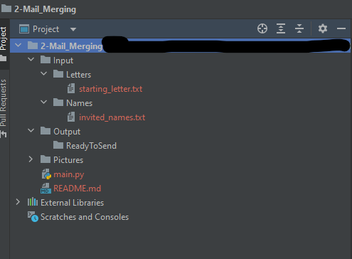

# Mail merge challenge

***

### Description:
<ul>
    <li>
    The objective is to automatically change the names of an e-mail invitation template.
    </li><li>
    You will have to work through the file paths dinamically.
    </li>
</ul>

### Hint:
<ol>
    <li>
    use method .readlines()
    </li>
    <li>
    use method replace()
    </li>
    <li>
    use method 'string'.join()
    </li>
</ol>

***

### Path directory should look like
#### Before:

#### Afterwards:
