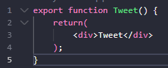
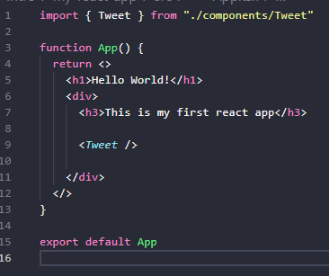
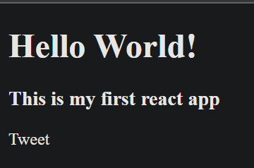
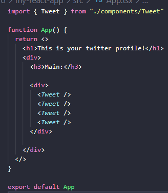
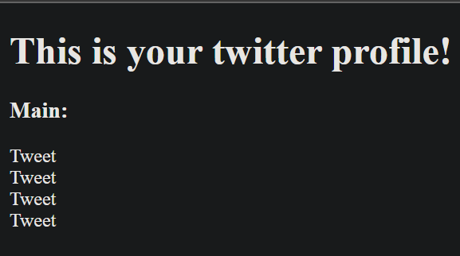
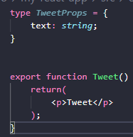

# **Learning Courses:** :books::brain:

<br>

### This is the ***root directory*** of all my projects done in **courses** and **university** lectures: :mortar_board::closed_book::robot:

<br>

# **SUMÁRIO:** :round_pushpin:

<br>

- [**Definição**](#definição)

<br>

# **Hyperlinks that help:**

1. **From JavaScript to React:** [Essential javascript-react](https://nextjs.org/learn/foundations/from-javascript-to-react/essential-javascript-react)

# **Definição:**
- O React é chamado de biblioteca e não de framework
    - Não traz muita opinião na estrutura de pastas em arquivos de configuração
        - A: ***Qual framework utilizar?***
    - Traz opinião em cima da linguagem, na forma de criar componentes e na parte visual.

# **Como criar um projeto com REACT:**
1. ### **Create react app:**
    ***Importante:*** 
    1. os browser só entendem arquivo JavaScript tradicional (<2022).
    2. os browsers não entendiam importações de arquivos JavaScript (<2022).

    - **webpack:**

        Um empacotador de módulos criado para agrupar arquivos JavaScript que estão sendo usados em um navegador. Uma funcionalidade importante é transformar, agrupar ou empacotar qualquer recurso. Eles são direcionados para um gráfico de dependência.

    - **babel:**
        
        Um transcompilador JavaScript gratuito e de código aberto que é usado principalmente para converter código ECMAScript 2015+ em código JavaScript compatível com versões anteriores que pode ser executado por mecanismos JavaScript mais antigos.

    - **ESLint:**

        Uma ferramenta de análise de código que, juntamente com a sua extensão de mesmo nome disponível no VSCode, permite identificar erros quanto ao padrão de escrita que definimos.

    - **others**

2. ### **Vite e Snowpack (2022)**:
     ***Importante:*** 
    1. grande maioria dos browsers suportam os **esmodules** (>2022).
        - permite importações de arquivos JavaScript de maneira nativa.
        - webpack já não se faz mais necessário.
        - vite e snowpack usam de suportes nativos ao ecmascript modules pra fazer o restante.
    2. muito mais perfomático, simples e rápido.

    - ### **Vite**:
        - Suporte a tecnologias mais famosas do ecossistema JavaScript para frontend:
            - vanila (javascript sem framework ou biblioteca)
            - vue
            - react
            - preact
            - lit
            - svelt
        
        - **Getting started**:
            1. Pré-requisitos:
                - 1. ter [node.js](https://nodejs.org/en/)
            2. ```$ npm create vite@latest my-vue-app -- --template vue```

        - **Run app**:
            1. ```$ cd my-react-app```
            - Não vem com uma pré-definição de qual gerenciador de pacotes vai utilizar (yarn, npm, etc.).
            - só vem com package.json
            - não roda instalação de dependências na criação do projeto
            - para isso é necessário utilizar:
                1. ex 1: npm install
                2. ex 2: yarn install
            2. ```$ npm  install```
            3. ```$ npm run dev```

        - **Files structure:**

            - **package.json:**
                - **Dependencias**:
                    - react: parte enxuta de interface.
                    - react-dom: documents object model. interface (html) da nossa aplicação. aporte do react para iniciar no browser, na dom (hoje em dia pode-se ter app react para mobile, tv, realidade virtual, etc.)

                - **Dependencias de desenvolvimento**:
                    - vite;
                    - vitejs/plugin-react;
                    - outros são para o typescript funcionar.

            - **./index.html**:
                - script type="module" -> permite usar dentro do script (src/main.tsx) os ecmascripts modules, ou seja, imports, exports, realizando uma árvore de importações, para que cada arquivo va tendo o código somente específico daquela funcionalidade.
                - core da estrutura html da applicação
                - geralmente uma div única (id=root ou id=app)
                    - o restante será escrito pelo javascript. interfaces, botões, etc.
                    - jogará tudo dentro da div root através do ./src/main

            - **./src/**:
                - onde ficam os códigos da nossa aplicação
                - obs: no react é tudo javascript, mesmo os arquivos de imagem e de estilização, todos importados dentro do javascript.
                    - inclusive o html também é usado dentro do javascript, chamado de JSX: javascript + xml
                1. deletar para começarmos simples:
                    - App.css
                    - index.css
                2. remover as dependências dos arquivos excluídos em App.tsx (junto com o conteúdo da função App()) e main.tsx.
                3. main.tsx.
                    - dentro do import do ReactDOM (integração react com o browser), executa método render no qual renderiza na tela o no App (componente), dentro do elemento que tem o ID 'root'.

        - **Componentes**:
            - função que retorna uma tag html
            - primeira letra em maiúsculo para diferenciar Componente React de tag html.
            - quebrar nossa aplicação em vários pedacinhos pequenos, facilitando a manutenção da nossa aplicação.
            1. ./src/components (create folder)
                1. criar novo component .tsx (create file)
                    1. exportar no código uma função (Componente).
                        1. retornar um código html na função:
                        
            2. no nosso App.tsx, podemos retornar a tag do componente criado ```return <Tweet />```:
            
            3. renderizando:
            
            - podemos ***retornar vários componentes***. porém, estes precisam estar sempre encapsulados, como mostra exemplo abaixo:
                
                

        - **[Propriedades](https://nextjs.org/learn/foundations/from-javascript-to-react/displaying-data-with-props)**:
            - personalizar cada instância do Componente, através de passagem de atributos
            1. Definir uma tipagem para a propriedade que deseja configurar no Componente:
            2. Configurar como parametro do Componente:
            3. Retornar na função typescript com o encapsulamento entre chaves para identificar que é uma variável typescript:

            

        - **Estado**:
            - interface interativa
            1. Atribuir uma constante, dentro do App, à função useState(), que cria uma variável que é monitorada pelo Component. Ou seja, toda vez que a variável muda seu valor, o Component é remontado, re-renderizado em tela, com as novas informações daquela variável.
            2. Adicionar lógica ao return
        
        - **Style**:
            1. Adicionar App.css
            2. Importar em App.css
            Ou:
            1. Usar css in js.
        
        - **Roteamento**:
            Permite que nossa aplicação tenha várias páginas.
            1. Instalar [React Router DOM]().
                ```$ npm install react-router-dom localforage match-sorter sort-by```
            2. Create ./pages/{pages}
            3. Create Routes.tsx and import libraries
            4. Create Router with Routes and Route for each page and Componente.
            5. Import it into App.tsx

    - ### A mais:
        1. Style UI:
            - [styled-components](https://styled-components.com/).
            - [Stitches](https://stitches.dev/)
            - [radix](https://www.radix-ui.com/)
        2. Data Fetching:
            - SWR
            - **React Query**
            - GraphQL
                - uRQL
                - ApolloClient
                - Relay
        3. State Management
                - Keep it Simple (Context + Reducer)
                - Zustand
        4. Testing
            - Testing Library
            - Cypress
        5. Framework
            - Next.js
            - Remix


***

<br>

- ### **Please, be welcome to check my profile:** :nerd_face::handshake:

<br>

<a href="https://github.com/DanScherr">
    
</a>