# **Learning Courses:** :books::brain

## This is the ***root directory*** of all my learning of **REACT.JS**: :mortar_board::closed_book::robot

***

- ## **SUMÁRIO:** :round_pushpin

    1. [Create Next.js app](./1-intro/)

***

1. ## **Project Goals:**

    - Components
    - Props
    - Data
    - Events
    - ContextAPI
    - Renderization:
        1. Client-Side App
        1. Use tool Json Server (create a fake backend)

2. ## **[Create React APP](https://pt-br.reactjs.org/docs/create-a-new-react-app.html)**

    1. ```$ npx create-react-app feedback--app --use-npm```

    1. Some commands we can use with npm:
        1. ```npm start```

            Starts the development server.

        2. ```npm run build```

            Bundles the app into static files for production.

        3. ```npm test```

            Starts the test runner.

        4. ```npm run eject```

            Removes this tool and copies build dependencies, configuration files and scripts into the app directory. If you do this, you can't go back!

3. ## **Structure**

    1. public/index.html:

        - first thing as we run the app that react will load
        - only has a div with 'root' id
            - that's because when we build a single page application everything we do including our components, routes, everything is done within javascript, within react, and inserted into this div. It's like a placeholder for our intire front-end.

    2. ./src/:

        - where we create our components, context, everything we do basically
        1. for this particullary project we'll delete everything in the src folder.
        2. run ```$ npm start```
        3. you'll see that we'll get an error because we don't have a specific file (index.js on src folder).
        4. Recreate index.js
            1. we'll see our index.html on ./public on the browser

4. ## **Insert our react app into the root div on ./public/index.html**

    - This happens at index.js. It's the entry point into react
    1. Import React and ReactDOM from 'react' and 'react-dom'
    2. Use ReactDOM.render():
        1. Place a Component into a DOM element.
        2. In index.js we'll place our main app Component, that's called App
        3. Other Components that we create will be embeded into that App Component
    3. Create App.js on ./src/
        - Main app component
        1. Write function App.
        2. export it
    4. Import App into index.js and render (embeded) it into root div on index.html
        - wrap it into React.StrictMode tag to activate some aditional checks and warnings
    5. Create index.css on ./src (as a global style) and import it on index.js

5. ## **Intro to JSX**

    - it's what all our react Components return
    - it's html but under the hood it's javascript
    - jsx element must be wrapped within an enclosing tag - like in a div or empty brackets
    - above the return we can create variables and functions
    - we can use the variables with brackets inside our return jsx
    - we can use lists and map to create a list of html elements (got to pass a key attribute that's unique to the element)

        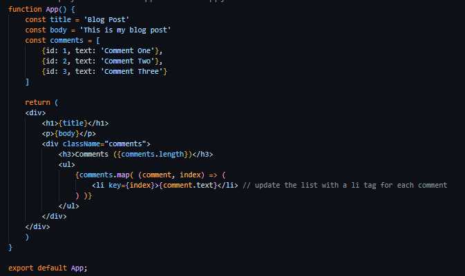

        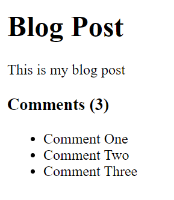

6. ## **Conditionals**

    - use variables for the conditional, html code block and others

    1. loading true and comments false

        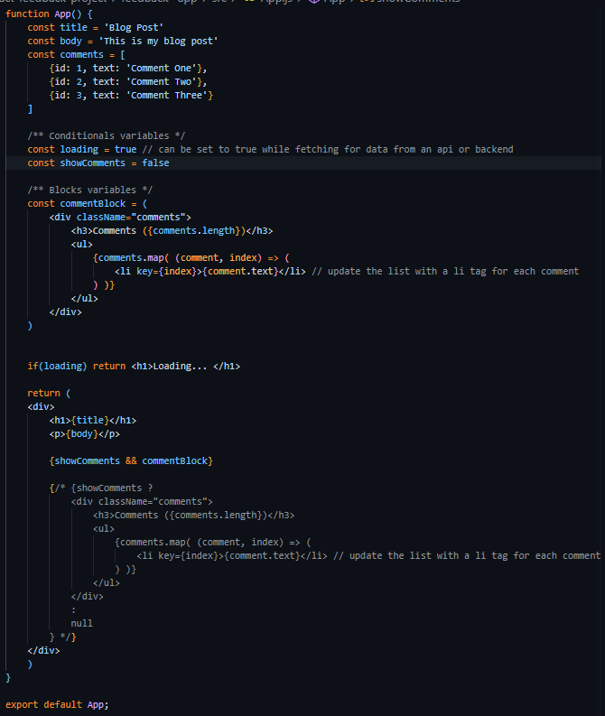

        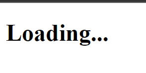

    2. loading false and comments false

        

    3. loading false and comments true

        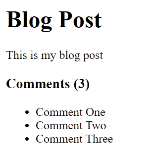

7. ## **Starting with Components**

    1. create on ./src/ a folder called components
        - Where we'll place all of our components
    2. create a Header.jsx component

        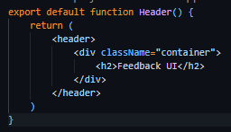

    3. import the Header component into our App.js

        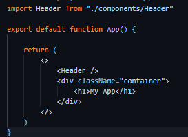

8. ## **Starting with Props**

    1. passing a prop through the Header component

        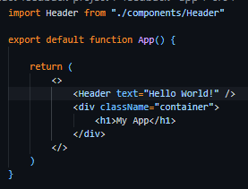

    2. catching props as the function parameter within the component
        - It's an object

        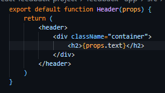

        or

        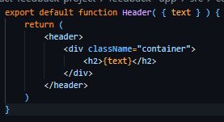

        getting:

        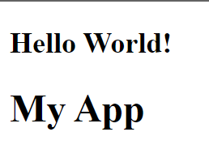

    3. Create default props

        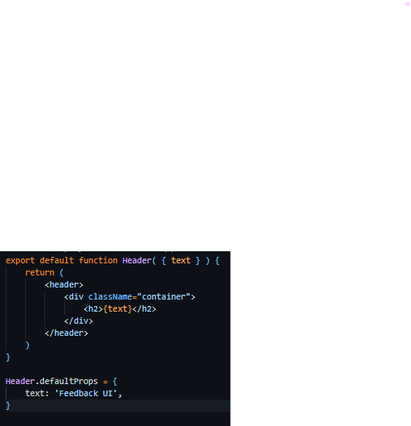

        so if we don't pass anything (while we're waiting for the client imput), we can show something as default:

        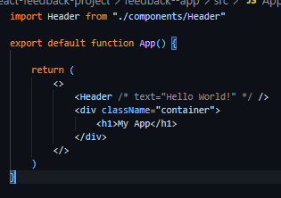

        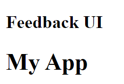

    4. Create prop types
        - checkers for props
        1. import PropTypes from 'prop-types'
        2. Configure it above the component function

                Header.propTypes = {
                    text: PropTypes.string
                }

9. ## **Adding Style**

    1. Use index.css -> global css created
    2. You can also use inline style in jsx files using style={{backgroundColor: 'blue', etc...}}
        - A nice way of doing it:
            1. set it into the component as a variable and use the variable in the style single set brackets;

                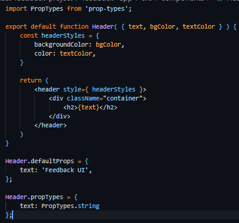

            2. we can also pass them as props as well, and make it dynamic;

                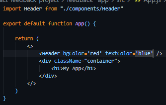

10. ## **State and useState hooks**

    - hooks always start with **use**
    - state is basically data.
    - we have component level state and app level ou global state:
        1. Component level is associated with a one specific component;
            - useState()
            1. create a new component called FeedBackItem
            2. import it into App.js
            3. code it

                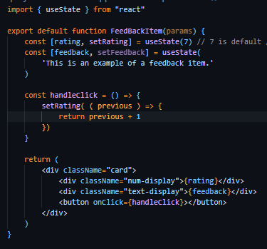

            - we'll not use this for our application

        2. Whereas global is for the entire application (able to share that state between multiple components)
            - state()
            1. Use it on our App.js to be able to pass the state throughout whereaver components
            2. Create a set o variables to receive values from use state
                1. We'll be passing a list to the useState that is going to be saved in src/data/FeedbackData.js that we'll be exporting
                2. Import list from src/data/FeedbackData.js
            3. Create a new component called FeedbackList (so we can map it)
            4. Import it on our App.js
                1. We'll pass as a prop to our feedback mapped with our useState hook

                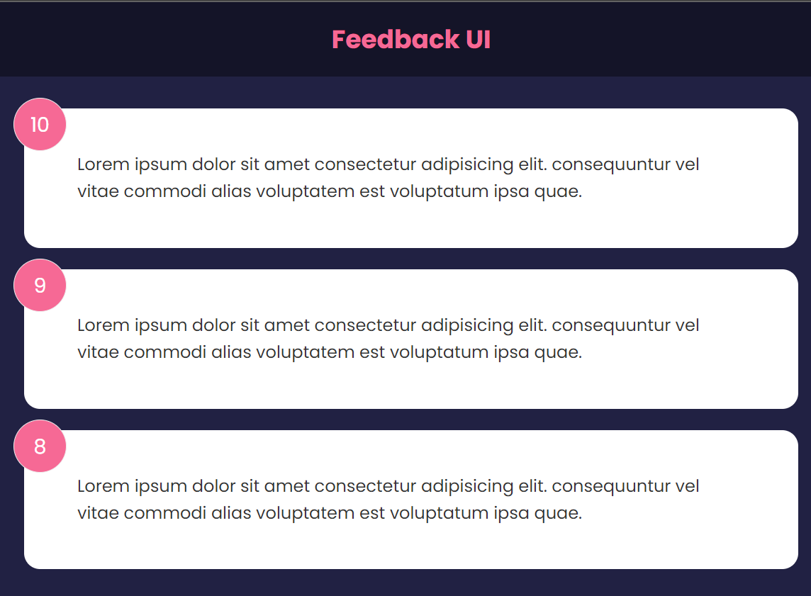

11. ## **Create a Card Component (abstraction) passing children as props**

    - It'll be created to work as the div with calssName 'card' in the FeedBackItem Component

    1. Create a folder under components/ called shared/
    2. Create a file inside that folder called Card.jsx
    3. Code the function component logic with passed {children} props to it.
        - children data type is a node
    4. Use the reverse prop with conditioning to dynamically style the component
    5. Add a defaultProp to set reverse as false on Card component
    6. We'll also add PropTypes, of our received props in params, checking on the recent created Components
        1. Card
        2. FeedBackItem
        3. FeedbackList (using arrayOf)

12. ## **Events and Prop Drilling**

    - Create button to delete feedback with react-icons
        1. install package

            ```$ npm i react-icons```

        2. Re-build app
        3. import it into FeedBackItem.jsx
        4. Create a button with the FaTimes Component imported from react-icons

    - Pass through the deleteHandler event:
        - To being able to click the button on FeedBackItem Component and alter the App Component, because it's there that we have our setFeedback function from useState(), we have to pass it upwards:
            1. Pass handleDelete as props in FeedbackList to FeedBackItem
            2. Take prop and pass it to the onClick attribute
            3. Then we'll pass it upwards from FeedbackList to App, by taking the handleDelete from it and passing it through as a props to the FeedBackItem.
            4. So to auter FeedbackList we'll call the Function (we'll create) passing it as a props on to the FeedbackList Component.
            5. Create the deleteFeedback function on App as well
                1. App?

                    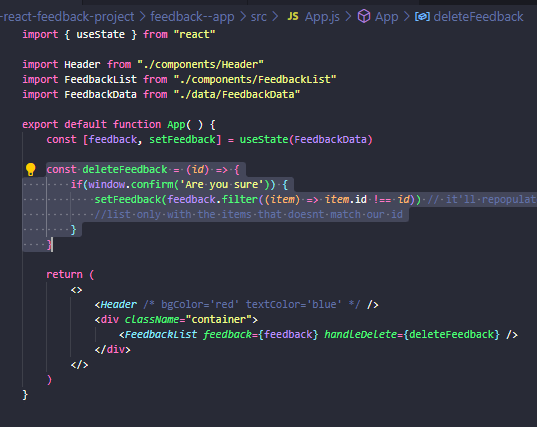

                2. FeedbackList:

                    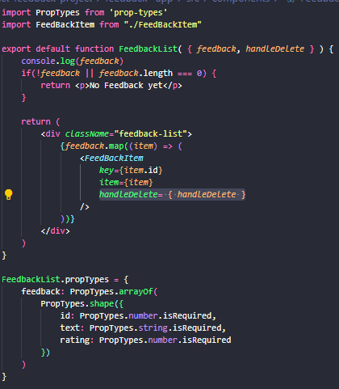

                3. FeedBackItem:

                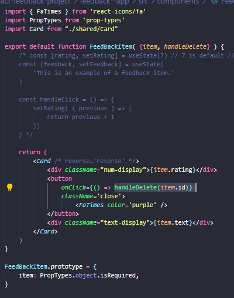

13. ## **Feedback Stats Length and Avarage**

    - It'll show the total number of feedback items and the avarage.

    1. Create new component FeedbackStats
    2. import it on App.js

14. ## **FeedbackForm with Event Handling**

    1. Create new Component: FeedbackForm.jsx
        - We usually have a piece of state for each imput of that form.
        - Because of that we'll use our useState hook.
            1. connect our input to our piece of state (text)
            2. so as a type in, we'll setText
                - We'll use onChange
                - We'll use [Event.target.value](https://developer.mozilla.org/en-US/docs/Web/API/Event/target) to pass the event of the input context

    2. import it on App.js

    3. ### **Creating Custom Submit Button**

        1. under components/share/ create new component: Button.jsx
        2. We'll pass children and version as params props
            1. children: so that we can wrap whatever the text size
            2. version: to retain to a specific class
            3. type: to check if it's submit or regular
            4. isDisabled: if it's true the button will be disabled, else ...
        3. import it on to our FeedbackForm Component

    4. ### **Real time state validation of Input**

        - supposed to be disabled unless we got at least 10 characters at input field
            - we'll dispose a message to tell it

        1. Create more two pisses of state ( const[] = useState() ) at FeedbackForm Component
            1. ```const [btnDisabled, setBtnDisabled] = useState(true)```
            2. ```const [message, setMessage] = useState('')```

        2. pass btnDisabled as a prop to isDiabled param in Button
        3. Create div with message style and content
        4. Set conditional states on handleTextChange

    5. ### **Rating Select Component**

        1. Create new Component: RatingSelect
        2. Import it on FeedbackForm
        3. Create more one piss of state on FeedbackForm:

            ```const [rating, setRating] = useState('10)```

        4. Create a piss of State for RatingSelect Component:

            ```const [selected, setSelected] = useState(10)```

        5. Pass the setRating state function as the 'select' prop to the RatingSelect Component in Feedback Form so that when we treat it on our RatingSelect component and trigger it on there, it'll set the Rating of the FeedbackForm
            - So now we can get text and rating of our feedback form

        6. Create the handleChange to handle our event and set to true the attribute checked of the input button

    6. ### **Create event handler to submit form**

        1. ```<form onSubmit={handleSubmit}>```
        2. create handleSubmit function
        3. Create addFeedback fucntion on App and pass it as a prop to FeedbackForm
        4. take prop param function handleAdd on FeedbackForm and use it on the handleSubmit function
        5. install uuid

            ```npm i uuid```

            - creates an ID

        6. import uuid
        7. implement setFeedback concatening the array with the newFeedback:

            ```setFeedback([newFeedback, ...feedback])```

    7. ### **Adding Animation to deleting and adding feedback**

        - Use Framer Motion library

        1. install:

            ```npm i framer-motion@4.1.17```

        2. import it on our FeedbackList Component

        3. Re-implement the return with AnimatePresence Component and motion.div

15. ## **Router**
    1. install:

        ```npm i react-router-dom```

    2. Create new page:
        1. Create folder pages under src
        2. Create page Component: AboutPage.jsx

    3. Import it on App.js
    4. Import BrowserRouter, Routes and Route so that we can work with routing
    5. To being abble to work with routing in a page or Component, we need to embed all of our return iside a Router tag
        - We'll do that on App.js

    6. Create a Route: use of Route Component

        1. ``````<Route path='/about' element={<AboutPage />} />``````

            - We would have to navigate through the browser to access it: http://localhost:3000/about
            - if we don't embed all the rest of our code into another Route'ing element attribute, when we navigate into the link we'll see all of our elements
            - if in that embeded Route (rest of our elements) there's no ```exact``` attribute, we'll still see it. So we got to implement it
            - And we need to embed all of the Route into Routes

    7. Implement AboutPage
    8. ### **Create Link to AboutPage**

        1. Create new Component: AboutIconLink.jsx
        2. Implement it with react-icons and Link (instead of ```<a href="">```)
            - Apply the same thing in the about page (HOME)
            - we can use ````to={{
                pathname: '/about'
            }}```` instead
                - and we can add query params to it like?

                        to={{
                        pathname: '/about',
                        search: '?sort',
                        hash: '#hello',
                        }}
        3. Import it on Header.js and App.js

    9. ### **Can use NavLink Component**
        - to set with activeClassName attribute an active link styling
        - it'll set the style when you be at the link
        1. Add NavLink Component into App
        2. Implement activeClassName={'active'}
        3. Style it

    10. ### **Can use useParams**
        - (have to import it into your Component) to take params from the browser (like props)
        - for example we could create a route like ```<Route path='/post/:id' element={<post />} />```
            - :id will be pass as a param to the component when we browse for the specific route
            - and we would/could take it with the useParams
        1. Create Component: Posts.jsx
        2. import on it 

    11. ### **Navigate**: redirect

        1. ```import { Navigate, useNavigate } from 'react-router-dom'```
        2. Implement Navigate with if statement: it'll be done on AboutPage
        3. Set a variable to useNavigate() and implement logic code with button
        4. You may change manually the status to see it redirecting and click the button

    12. ### **Nested Routes**

        - We'll be working with AboutPage.jsx
        1. For it to work we got to edit in App.js our AboutPage Route to path="/about/*"
        2. Import and implement Routes + Route on AboutPage.jsx with an element attribute
        3. The browser will only show the element if we are at /about/show

16. ## **Context API, useContext Hook & Deployment**

    - our app is done but all we have are at app.js
    - we want to start to move it to a global context, a global state that we can use to pass our state down to our components through the context rather than have it all in our app.js

    1. ### **Create a [Context](https://reactjs.org/docs/context.html) and Provider**

        - Context provides a way to pass data through the component tree without having to pass props down manually at every level.

        - In a typical React application, data is passed top-down (parent to child) via props, but such usage can be cumbersome for certain types of props (e.g. locale preference, UI theme) that are required by many components within an application. Context provides a way to share values like these between components without having to explicitly pass a prop through every level of the tree.

        - Before, wherever we'ld create a state we would have to pass it down as props to our components in order to use them.

        - What we want to do is to move our globe states and any functions to manipulate it into Context and then bring it in into the Component directly.

        1. Create new folder called context under src.

        2. Create a file in the context folder called FeedbackContext.js

        3. Import

            ```import { createContext, useState } from 'react';```

        4. Instantiate an object (set a viable) of createContext()

        5. Create a Provider
            - So that we can wrap it up the components we want to 'pass' the context with it (like the Router) instead of passing a props as attributes.

            1. Export a variable provider that receives a function that has as its parameters {children}, so that we can wrap it up the components with our provider

            2. Create a piece of state, in our case feedback and setFeedback with useState

            3. Return our Provider with a value prop attribute with our feedback being passed on it and wrapping up the children

        6. Import our provider on App.js

        7. Wrap everything.

    2. ### **Get Global State with the useContext hook: Use data from our created Context**

        1. Go to our FeedbackList Component and import useContext hook and our create context

            1. ```import { useContext } from 'react'```

            2. ```import FeedbackContext from '../context/FeedbackContex'```

        2. Extract into variable(s) the context of the FeedbackContext by useContext().
            - We'll have access to anything that's being passed inside the value attribute as props: feedback

            ```const {feedback} = useContext(FeedbackContext)```

        3. We don't have to being passing feedback as a prop to our FeedbackList Component anymore, neither our FeedbackList.propTypes

        4. We dont need to pass feedback as a prop on App.js

        5. Do the same thing for FeedbackStats Component

    3. ### **Moving Function to Context:**

        1. Cut the deleteFeedback function from app and paste it on our FeedbackProvider right under our state.

        2. Pass it on the value attribute in our FeedbackContext.Provider

        3. So we no longer need to pass it on App.js to our FeedbackList Component as a prop

        4. Go to our FeedbackList:
            - because we don't have to be passing it to the FeedBackItem
            1. Can get rid of:
                - handleDelete param prop
                - prop being passed to FeedBackItem

        5. Do the same thing on 16.2.1 to the FeedBackList with deleteFeedbacl

        6. We'll have to replace handleDelete for deleteFeedback

        7. Do the same thing for addFeedback
            - remeber to cut the import of the v4 from uuid from App to FeedbackContext
            - clean up App.js
            - update FeedbackForm

    4. ### **Create EditFeedback Event:**

        - We'll have to add a new piece of Global State to add a flag to us to know which item is being edited when we click on the icon

        1. Import FaEdit along with FaTimes in FeedbackItem

        2. Create edit button with the FaEdit icon

        3. Add the new piece of state on FeedbackContext

        4. Create a constant that receives a function to treat our feedbackEdit

        5. Pass it on value Attribute of FeedbackContext.Provider

        6. Import it on FeedBackItem and set it on our const as well

        7. Implement it on the onClick event of the edit button

            - At this point nothing will happen in our UI

        8. Add feedbackEdit to our value Attribute of FeedbackContext.Provider, so that we can access it's data in our Components

        9. Add feedbackEdit in our FeedbackForm
            - So whenever it changes on our feedbackEdit, we want the form to get the text and rating from the feedback selected, and that's called a side effect

        10. Import useEffect on FeedbackForm

        11. Implement useEffect
            - It'll implement the text just fine but the rating will be getting the data but it'll not be showing on our UI, because we've changed the FeedBackItem with our editFeedback function, but didnt set to change ou RatingSelect Component

        12. Implement useEfect on RatingSelect

        13. Create new function on FeedbackContext to update feedback selected

        14. Get the function on our FeedbackFrom 

        15. Call it on submit button with conditioning it

17. ## **APIs & HTTP Requests**

    1. ### **Setting Up JSON-Server Mock Backend**
        1. installing it:

                ```npm i json-server```

        2. Add Script to package.json:

                ```"server": "json-server --watch db.json --port 5000"```

        3. Create db.json file on ./root
            - where we are going to put our data
            1. Create Schema (tables):
                - we'll only have one for feedbacks
            2. Create objects for the tables with fields

        4. Run Server:

            ```npm run server```

        5. Using Postman for the requests.

            "http://localhost:5000/{schema-name}"

            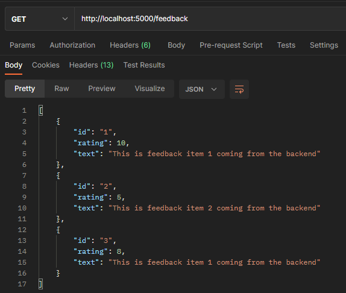

            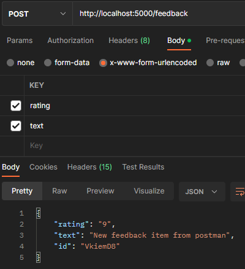

            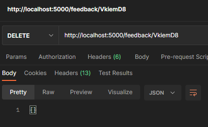

    2. ### **Run Client and Server Concurrently**

        1. Install concurrently:
            ```npm i concurrently```

        2. Create a Script in package.json:
            ```Create a Script in package.json:```

        3. Run:
            ```npm run dev```

    3. ### **Update Feedback app to fetch from Mock Backend**

        1. Replace data for an empty array on the piece of State for feedback and setFeedback instance

        2. Import useEffect to run this as soon as our context loads in our App

        3. Create an async function to fetch feedback and saving it into a variable, setting our feedback on to the data. Call this function on ou useEffect

            - It can take a while to fetch data, so it's nice to have a loading flag on the state to show like a spinner.

        4. Create Spinner as a loading flag:
            1. create a new piece of state for our provider seting it to true as deffault, to be true until we receive the request and then we'll set it to false.
            2. SetIsLoading(false) on fetchFeedbakck aget setFeeback(data)
            3. We'll pass our Loading state to any component passing it on to our values attribute of our FeedbackContext.Provider, so that we can create a spinner to be shown while we don't get our response from the Backend

            4. Spinner Component:
                1. Create assets folder on components folder
                2. Bring gif file to it (from github repository)
                3. Bring isLoading with feedback useContext on the feedbackList
                4. Add !isLoading to the condition code

            5. Create Spinner Component on shared folder
                1. Import gif
                2. implement code with returning an img
                3. import it on FeedbackList Component

        5. Creating a proxy:
            1. add to package.json:

                ```"proxy": "http://localhost:5000"```

        6. Updating getting data from our Mock Backend:
            1. update addFeedback
            2. update deleteFeedback
            3. update updateFeedback
    

***

- ### **Please, be welcome to check my profile:** :nerd_face::handshake:

<a href="https://github.com/DanScherr">
    
</a>
