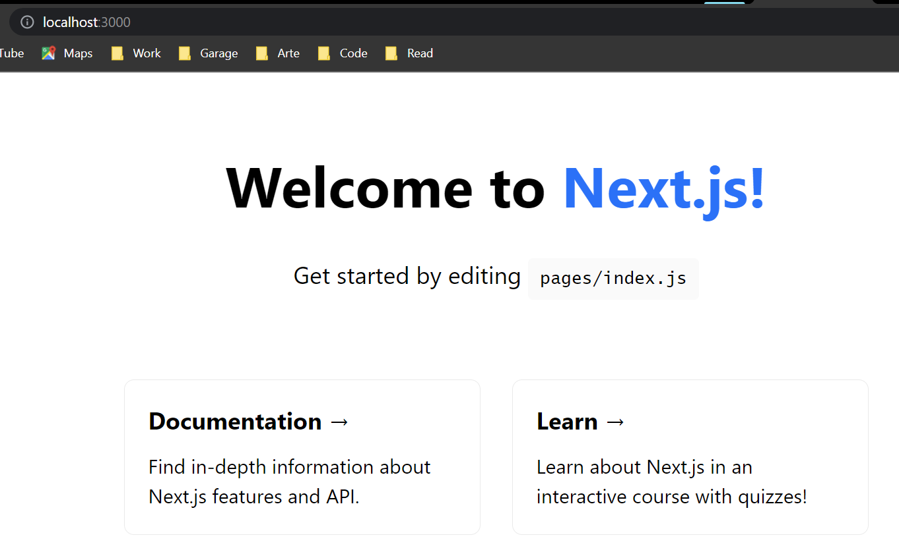

# **Learning Courses:** :books::brain:

<br>

### This is the ***Next.js directory*** of my learning with **REACT.JS**: :mortar_board::closed_book::robot:

<br>

# **SUMÁRIO:** :round_pushpin:

<br>

1. [Intro](./1-intro/)

<br>

# **Pre-requirements to build a React.js application:**

1. Code has to be bundled using a bundler like **webpack** and transformed using a compiler like **Babel**.
2. You need to do **production optimizations** such as code splitting.
3. You might want to statically pre-render some pages for performance and SEO. You might also want to use server-side rendering or client-side rendering.
4. You might have to write some server-side code to connect your React app to your data store.

- All of that is covered in [here](./../2-from-js-to-next/).

- A framework can solve these problems.

<br>

# **Next.js: The React Framework**:

- Next.js provides a solution to all of the above problems.

- Next.js aims to have best-in-class developer experience and many built-in features, such as:

    - An intuitive **page-based routing system** (with support for dynamic routes);
    - **Pre-rendering**, both static generation (SSG) and server-side rendering (SSR) are supported on a per-page basis;
    - **Automatic code splitting** for faster page loads;
    - **Client-side routing** with optimized prefetching
    - Built-in CSS and Sass support, and support for any CSS-in-JS library;
    - Development environment with Fast Refresh support;
    - **API routes to build API endpoints with Serverless Functions
    Fully extendable**.

# **Setup**:

1. Node.js installed, version >10.13.

# Create a Next.js app:

1. On terminal: ```npx create-next-app@latest nextjs-blog --use-npm --example "https://github.com/vercel/next-learn/tree/master/basics/learn-starter"```
    - Uses **[create-next-app](https://nextjs.org/docs/api-reference/create-next-app)**.
    - This CLI tool enables you to quickly start building a new Next.js application, with everything set up for you. You can create a new app using the default Next.js template, or by using one of the official [Next.js examples](https://github.com/vercel/next.js/tree/canary/examples).

        

# **Navigate between pages:**

- Create a new page using the [integrated file system routing](https://nextjs.org/docs/routing/introduction).
- Learn how to use the [Link component](https://nextjs.org/docs/api-reference/next/link) to enable client-side navigation between pages.
- Learn about built-in support for code splitting and prefetching.

- ## **Pages in Next.js:**
    In Next.js, a page is a React Component exported from a file in the pages directory.

    Pages are associated with a route based on their file name. For example, in development:

    - pages/index.js is associated with the / route.
    - pages/posts/first-post.js is associated with the /posts/first-post route.

    We already have the pages/index.js file, so let’s create pages/posts/first-post.js to see how it works.

1. ## **Create new page:**
    1. Create a file called first-post.js inside the posts directory with the following content:

            export default function FirstPost() {
                return <h1>First Post</h1>;
                }

    - The component can have any name, but **you must export** it **as a default export.**

    - Now, make sure that the development server is running and visit http://localhost:3000/posts/first-post. You should see the page created.


2. ## **Link Component**
    When linking between pages on websites, you use the ```<a>``` HTML tag.

    In Next.js, you can use the Link Component next/link to link between pages in your application. ```<Link>``` allows you to do client-side navigation and accepts props that give you better control over the navigation behavior.

3. ## **Using <Link>**:
    Import the Link class on index.ts (where you want to create the link):
        ```import Link from 'next/link';```
    
    - Make the change on the coding in index.js

4. ## **Client Side Navigation**:
    - The Link component enables client-side navigation between two pages in the same Next.js app.

    - Client-side navigation means that the page transition happens using JavaScript, which is faster than the default navigation done by the browser.

    1. You may check-it by changing the background color and moving from onde page into another. You'll see that the background color persists between page transitions.
        - This shows that the browser does not load the full page and client-side navigation is working.

        - If you’ve used ```<a href="…"> ```instead of ```<Link href="…">``` and did this, the background color will be cleared on link clicks because the browser does a full refresh.`
    
    - ### **Code splitting and prefetching**
        Next.js does **code splitting automatically**, so each page only loads what’s necessary for that page. That means when the homepage is rendered, the code for other pages is not served initially.

        This ensures that the homepage **loads quickly** even if you have hundreds of pages.

        Only loading the code for the page you request also means that **pages become isolated**. If a certain page throws an error, the **rest of the application would still work**.

        Furthermore, in a production build of Next.js, **whenever Link components appear in the browser’s viewport, Next.js automatically prefetches the code for the linked page in the background.** By the time you click the link, the code for the destination page will already be loaded in the background, and the page transition will be near-instant!
    
<br>

# **Assets, Metadata, and CSS**:

- **What'll be covered:**
    - How to add static files (images, etc) to Next.js.
    - How to customize what goes inside the <head> for each page.
    - How to create a reusable React component which is styled using - CSS Modules.
    - How to add global CSS in pages/_app.js.
    - Some useful tips for styling in Next.js.
    
- ## **Assetes:**
    Next.js can serve static assets, like images, under the top-level **public directory**. Files inside public can be referenced from the root of the application similar to pages.

    The public directory is also useful for robots.txt, Google Site Verification, and any other static assets. Check out the documentation for [Static File Serving](https://nextjs.org/docs/basic-features/static-file-serving) to learn more.

    1. Download Profile Picture:
        1. Create an images directory inside of the public directory.
        1. Save the picture as profile.jpg in the public/images directory.
        1. The image size can be around 400px by 400px.
        1. You may remove the unused SVG logo file directly under the public directory.
    
    2. Use Image Component and Image Optimization:
        - **Image Component** Handles for you:
            - Ensuring your image is responsive on different screen sizes
            - Optimizing your images with a third-party tool or library
            - Only loading images when they enter the viewport
        - Next.js also has support for **Image Optimization** by default. 
            - **This allows for resizing, optimizing, and serving images in modern formats** like WebP when the browser supports it. 
            - This avoids shipping large images to devices with a smaller viewport.
            - It also allows Next.js to automatically adopt future image formats and serve them to browsers that support those formats.
            - Automatic Image Optimization works with any image source. Even if the image is hosted by an external data source, like a CMS, it can still be optimized.
    
    3. ### **Using the image Component:**
        1. Update components/layout.module.css;


- ## **Metadata:**

    1. **Adding Head to first-post.js:**
        We haven't added a ```<title>``` to our /posts/first-post route. Let's add one.

        1. Open the pages/posts/first-post.js file and add an import for Head from next/head at the beginning of the file.

        2. Then, update the exported FirstPost component to include the Head component. For now, we‘ll add just the title tag.

    2. **Third party javascript:**
        - refers to any scripts that are added from a third-party source. 
        Usually, third-party scripts are included in order to introduce newer functionality into a site that does not need to be written from scratch, such as analytics, ads, and customer support widgets.

        1. **Adding Third-Party JavaScript:**
            - scripts that need to load and execute as soon as possible are usually added within the ```<head>``` of a page. Using a regular HTML ```<script>``` element, an external script would be added as follows:

                    <Head>
                    <title>First Post</title>
                    <script src="https://connect.facebook.net/en_US/sdk.js" />
                    </Head>
            
            - Using the Script Component:
                - next/script is an extension of the HTML ```<script>``` element and optimizes when additional scripts are fetched and executed.

                1. ```import Script from 'next/script';``` in first-post;

                2. code script on first-post;

                3. Notice that a few additional properties have been defined in the Script component:

                    - ```strategy``` controls when the third-party script should load. A value of lazyOnload tells Next.js to load this particular script lazily during browser idle time
                    - ```onLoad``` is used to run any JavaScript code immediately after the script has finished loading. In this example, we log a message to the console that mentions that the script has loaded correctly

- ## CSS Styling:
    - If you look at your file structure, you'll see a **folder called styles** with two CSS files: 
        1. a global stylesheet (```globals.css```)
        2. a CSS module (```Home.module.css```).
        - If your project doesn't have those files, you can download the starter code here:
            ```npx create-next-app nextjs-blog --use-npm --example "https://github.com/vercel/next-learn/tree/master/basics/assets-metadata-css-starter"```

    1. ### **CSS Modules:**
        - allow you to locally scope CSS at the component-level by automatically creating unique class names. 
        - This allows you to use the same CSS class name in different files without worrying about class name collisions.
        - In addition to CSS modules, you can style your Next.js application in a variety of ways, including:

            1. Sass which allows you to import .css and .scss files.
            2. PostCSS libraries like [Tailwind CSS](https://github.com/vercel/next.js/tree/canary/examples/with-tailwindcss).
            3. CSS-in-JS libraries such as [styled-jsx](https://github.com/vercel/styled-jsx), [styled-components](https://github.com/vercel/next.js/tree/canary/examples/with-styled-components), and [emotion](https://github.com/vercel/next.js/tree/canary/examples/with-emotion).
        
        1. #### **Layout Component shared between all pages:**
            1. Create a top-level directory called components.
            1. Inside components, create a file called layout.js with the following content:

                    export default function Layout({ children }) {
                        return <div>{children}</div>;
                    }

            2. Then, open pages/posts/first-post.js, add an import for the Layout component, and make it the outermost component;

            3. #### **Adding CSS**
                1. Now, let’s add some styles to the Layout component. To do so, we’ll use CSS Modules, which lets you import CSS files in a React component.

                2. Create a file called components/layout.module.css with the following content:

                        .container {
                            max-width: 36rem;
                            padding: 0 1rem;
                            margin: 3rem auto 6rem;
                        }
                
                - **Important:** To use CSS Modules, the CSS file name must end with .module.css.

                3. To use this container class inside components/layout.js, you need to:

                    1. Import the CSS file and assign a name to it, like styles;
                    1. Use styles.container as the className.

            4. If you go to http://localhost:3000/posts/first-post now, you should see that the text is now inside a centered container.
        
        - ### Automatically Generates Unique Class Names
            - If you take a look at the HTML in your browser’s devtools, you’ll notice that the div rendered by the Layout component has a class name that looks like layout_container__...:
            - This is what CSS Modules does: It automatically generates unique class names. As long as you use CSS Modules, you don’t have to worry about class name collisions.
            -Furthermore, Next.js’s code splitting feature works on CSS Modules as well. It ensures the minimal amount of CSS is loaded for each page. This results in smaller bundle sizes.

            - CSS Modules are extracted from the JavaScript bundles at build time and generate .css files that are loaded automatically by Next.js.

        
    2. ## **Global Styles**:
        - CSS Modules are useful for component-level styles.
        - To load global CSS to your application, create a file called pages/_app.js with the following content:

                export default function App({   Component, pageProps }) {
                    return <Component {...pageProps} />;
                }

        - The default export of _app.js is a top-level React component that **wraps all the pages in your application.** You can use this component to keep state when navigating between pages, or to add global styles
        
        - **Important:** You need to restart the development server when you add pages/_app.js.
        
        1. ### **Adding Global CSS:**
            - In Next.js, you can add global CSS files by importing them from pages/_app.js. You cannot import global CSS anywhere else.
            1. Create a top-level styles directory and a global.css file.
            2. Add the following CSS inside styles/global.css. This code resets some styles and changes the color of the a tag:

                    html,
                    body {
                    padding: 0;
                    margin: 0;
                    font-family: -apple-system, BlinkMacSystemFont, Segoe UI, Roboto, Oxygen, Ubuntu,
                        Cantarell, Fira Sans, Droid Sans, Helvetica Neue, sans-serif;
                    line-height: 1.6;
                    font-size: 18px;
                    }

                    * {
                    box-sizing: border-box;
                    }

                    a {
                    color: #0070f3;
                    text-decoration: none;
                    }

                    a:hover {
                    text-decoration: underline;
                    }

                    img {
                    max-width: 100%;
                    display: block;
                    }

            3. Finally, import the CSS file inside the pages/_app.js file you've created earlier on;

            4. Restart server
        
    3. ## **Create styles/utils.module.css**
        - Second, let’s create a set of CSS utility classes (for text styles) that can be re-used across multiple components.

        1. Add a new CSS file called styles/utils.module.css

        - You can reuse these utility classes throughout your application, and you may even use utility classes in your global.css file. Utility classes refer to an approach of writing CSS selectors rather than a method (e.g. global styles, CSS modules, Sass, etc). Learn more about [utility-first CSS](https://tailwindcss.com/docs/utility-first).

        2. Update components/layout.js importing it.
        3. Update pages/index.js

    4. ## **Styling tips:**
        1. ### **Using clsx library to toggle classes**
            - clsx is a simple library that lets you toggle class names easily. You can install it using npm install clsx or yarn add clsx.
            - [documentation](https://github.com/lukeed/clsx).

        2. ### **Customizing PostCSS Config**
            - Out of the box, with no configuration, Next.js compiles CSS using PostCSS.

            - To customize PostCSS config, you can create a top-level file called postcss.config.js. This is useful if you're using libraries like Tailwind CSS.

            - Here are the steps to add Tailwind CSS:
                1. First, install the packages:
                    ```npm install -D tailwindcss autoprefixer postcss```
                2. create a postcss.config.js:

                        // postcss.config.js
                        module.exports = {
                        plugins: {
                            tailwindcss: {},
                            autoprefixer: {},
                        },
                        };

                3. It's recommend configuring content sources by specifying the content option on tailwind.config.js:

                        // tailwind.config.js
                        module.exports = {
                        content: [
                            './pages/**/*.{js,ts,jsx,tsx}',
                            './components/**/*.{js,ts,jsx,tsx}',
                            // For the best performance and to avoid false positives,
                            // be as specific as possible with your content configuration.
                        ],
                        };

        3. ### Using Sass
            - Out of the box, Next.js allows you to import Sass using both the .scss and .sass extensions. You can use component-level Sass via CSS Modules and the .module.scss or .module.sass extension.

            - Before you can use Next.js' built-in Sass support, be sure to install sass:
                ```npm install -D sass```

<br>

***

<br>

- ### **Please, be welcome to check my profile:** :nerd_face::handshake:

<br>

<a href="https://github.com/DanScherr">
    
</a>