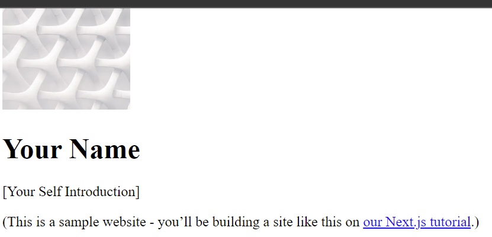
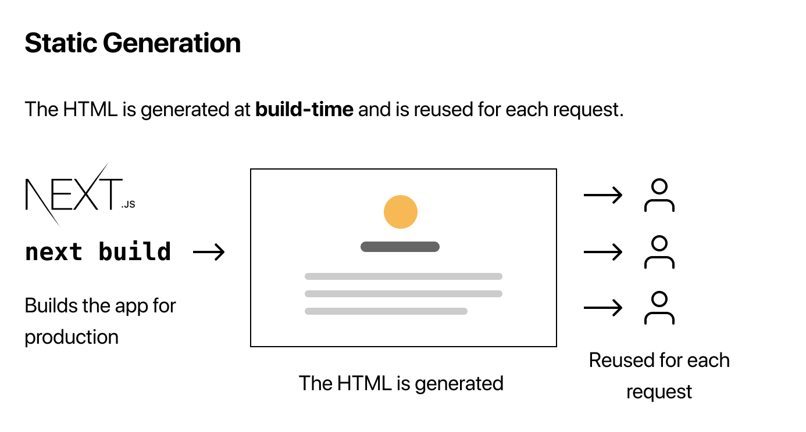

# **Learning Courses:** :books::brain:

 

### This is the ***Pre-Rendering Pages Tutorial*** of my learning with **Next.js directory**: :mortar_board::closed_book::robot:

 

# **SUMÁRIO:** :round_pushpin:

 

1. **[Pre-Rendering Pages](#pre-rendering-pages)**
    1. **[Definition: Theory](#definition)**
    1. **[Disabling js on browser: checking](#by-disabling-js-on-the-browser)**
    1. **[Differences: Theroy](#differences)**
    1. **[Forms of pre-rendering](#forms-of-pre-rendering)**
        1. [Static Generation](#static-generation)
        1. [Server-Side](#server-side-rendering)
    1. **[Free Will](#free-will)**
    1. **[When to use it](#when-to-use)**

 

1. # **[Pre-Rendering Pages](https://nextjs.org/docs/basic-features/pages#pre-rendering):**
    Back to **[top](#learning-courses-booksbrain)**. :point_left::top:

    1. ## **Definition:**
        Back to **[top](#learning-courses-booksbrain)**. :point_left::top:

        By default, **Next.js pre-renders every page**. This means that Next.js generates HTML for each page in advance, instead of having it all done by client-side JavaScript. Pre-rendering can result in better performance and SEO.
        Each generated HTML is associated with minimal JavaScript code necessary for that page. When a page is loaded by the browser, its JavaScript code runs and makes the page fully interactive. (This process is called hydration.)

    2. ## **By disabling JS on the browser:**
        Back to **[top](#learning-courses-booksbrain)**. :point_left::top:

        

    3. ## **Differences:**
        Back to **[top](#learning-courses-booksbrain)**. :point_left::top:

        

        

    4. ## **Forms of pre-rendering:**
        Back to **[top](#learning-courses-booksbrain)**. :point_left::top:

        1. ### **Static Generation**: 
            is the pre-rendering method that generates the HTML **at build time**. The pre-rendered HTML is then reused on each request.
            
            
        2. ### **Server-side Rendering**: 
            is the pre-rendering method that generates the HTML **on each request.**
            

        - In development mode (when you run npm run dev or yarn dev), pages are pre-rendered on every request. This also applies to Static Generation to make it easier to develop. When going to production, Static Generation will happen once, at build time, and not on every request.

    5. ## **Free Will:**
        Back to **[top](#learning-courses-booksbrain)**. :point_left::top:

        - Importantly, Next.js lets you choose which pre-rendering form to use for each page. You can create a "hybrid" Next.js app by using Static Generation for most pages and using Server-side Rendering for others.

            

    6. ## **When to use:**
        Back to **[top](#learning-courses-booksbrain)**. :point_left::top:

        - It's recommend using Static Generation (with and without data) whenever possible because your page can be built once and served by CDN, which makes it much faster than having a server render the page on every request.

        - You can use Static Generation for many types of pages, including:
            1. Marketing pages
            2. Blog posts
            3. E-commerce product listings
            4. Help and documentation
            5. You should ask yourself: "Can I pre-render this page ahead of a user's request?" If the answer is yes, then you should choose Static Generation.

        - On the other hand, Static Generation is not a good idea if you cannot pre-render a page ahead of a user's request. Maybe your page shows frequently updated data, and the page content changes on every request.

        - In that case, you can use Server-side Rendering. It will be slower, but the pre-rendered page will always be up-to-date. Or you can skip pre-rendering and use client-side JavaScript to populate frequently updated data.

 

***

 

- ### **Please, be welcome to check my profile:** :nerd_face::handshake:

 

