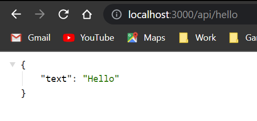

# **Learning Courses:** :books::brain:

<br>

### This is the ***API Routes Tutorial*** of my learning with **Next.js directory**: :mortar_board::closed_book::robot:

<br>

# **SUMÁRIO:** :round_pushpin:

<br>

1. **[Creating API Routes](#creating-api-routes)**
    1. **[Introduction](#introduction)**
    1. **[Creating a simple API endpoint](#creating-a-simple-api-endpoint)**
    1. **[API Routes Details](#api-routes-details)**
        1. **[Do Not Fetch an API Route from getStaticProps or getStaticPaths](#do-not-fetch-an-api-route-from-getstaticprops-or-getstaticpaths)**
        1. **[A Good Use Case: Handling Form Input](#a-good-use-case-handling-form-input)**
        1. **[Dynamic API Routes](#dynamic-api-routes)**

<br>

# **Creating API Routes:**
Back to **[top](#learning-courses-booksbrain)**. :point_left::top:

1. ## **Introduction:**
    Back to **[top](#learning-courses-booksbrain)**. :point_left::top:

    - API Routes let you create an API endpoint inside a Next.js app. You can do so by creating a function inside the pages/api directory that has the following format:

            // req = HTTP incoming message, res = HTTP server response
            export default function handler(req, res) {
            // ...
            }

        - Learn more about the request handler above in the [API Routes documentation](https://nextjs.org/docs/api-routes/introduction).
        - They can be deployed as Serverless Functions (also known as Lambdas).

2. ## **Creating a simple API endpoint:**
    Back to **[top](#learning-courses-booksbrain)**. :point_left::top:

    1. Create a file called hello.js in pages/api with the following code;
    2. Try accessing it at http://localhost:3000/api/hello. You should see {"text":"Hello"};
        

    - ```req``` is an instance of [http.IncomingMessage](https://nodejs.org/api/http.html#http_class_http_incomingmessage), plus some [pre-built middlewares](https://nextjs.org/docs/api-routes/request-helpers).
    - ```res``` is an instance of http.[ServerResponse](https://nodejs.org/api/http.html#http_class_http_serverresponse), plus some [helper functions](https://nextjs.org/docs/api-routes/response-helpers).

3. ## **API Routes Details:**
    Back to **[top](#learning-courses-booksbrain)**. :point_left::top:

    1. ### **Do Not Fetch an API Route from getStaticProps or getStaticPaths:**
        Back to **[top](#learning-courses-booksbrain)**. :point_left::top:

        - You should not fetch an API Route from getStaticProps or getStaticPaths, because they run only on the server-side and will never run on the client-side. 
        - Instead, write your [server-side code](https://nextjs.org/docs/basic-features/data-fetching/get-static-props#write-server-side-code-directly) directly in getStaticProps or getStaticPaths (or call a helper function).

    2. ### **A Good Use Case: Handling Form Input:**
        Back to **[top](#learning-courses-booksbrain)**. :point_left::top:

        - A good use case for API Routes is handling form input. For example, you can create a form on your page and have it send a POST request to your API Route. You can then write code to directly save it to your database. The API Route code will not be part of your client bundle, so you can safely write server-side code.

                export default function handler(req, res) {
                    const email = req.body.email;
                    // Then save email to your database, etc...
                }
        - Examples of good use cases:
            1. Saving incoming data to your database
            2. Securely communicating with a third-party API (request)
            3. Previewing draft content from your CMS (To learn more about it take a look at our [Preview Mode documentation](https://nextjs.org/docs/advanced-features/preview-mode).)

    3. ### **Dynamic API Routes:**
        Back to **[top](#learning-courses-booksbrain)**. :point_left::top:
        
        - ***API Routes can be dynamic***, just like regular pages. Take a look at our Dynamic [API Routes documentation](https://nextjs.org/docs/api-routes/dynamic-api-routes) to learn more.


<br>

***

<br>

- ### **Please, be welcome to check my profile:** :nerd_face::handshake:

<br>

<a href="https://github.com/DanScherr">
    
</a>