# **Learning Courses:** :books::brain:

<br>

### This is the ***root directory*** of all my learning of **REACT.JS**: :mortar_board::closed_book::robot:

<br>

# **SUMÁRIO:** :round_pushpin:

<br>

1. [Create Next.js app](./1-intro/)

<br>

# **Create Next.js app:**
1. If not, install yarn:

    ```$ npm install --global yarn```

2. Create Next app:
    
    ```$ yarn create next-app```

3. Run app:
    1. Enter app directory
        
        ```$ cd {app-directory}```

    2. Run dev
        
        ```$ yarn dev```

# **[Install and Configure Stitches:](https://stitches.dev/docs/installation)**
## 1. With npm
```npm install @stitches/react```

## 2. With yarn
```yarn add @stitches/react```


# **Using it:**

1. ## Using css:
    1. ### Import:
        ```import { css } from '@stitches/react';```
    
    2. ### Using:
        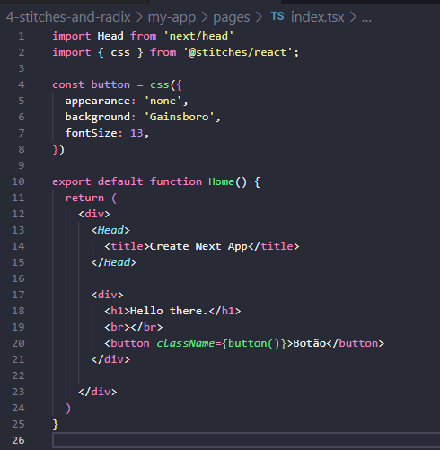

        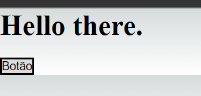

2. ## **Creating Variants:**

    1. ### **Implementing it:**
        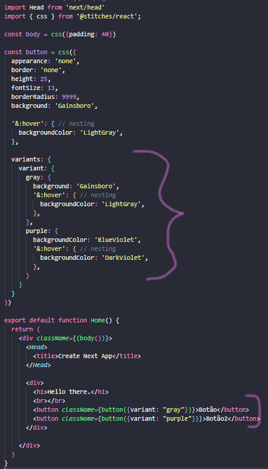

        1. #### **Visualizing in browser:**
            

    2. ### **Default:**
        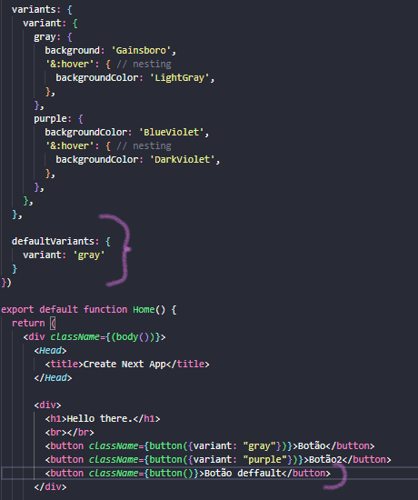

        1. #### **Visualizing in browser:**
            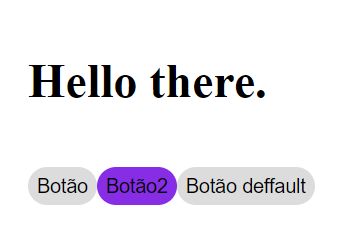

    
3. ## **Combining Variants:**
    1. ### Creating:
        

        1. ### **Visualizing in browser:**
            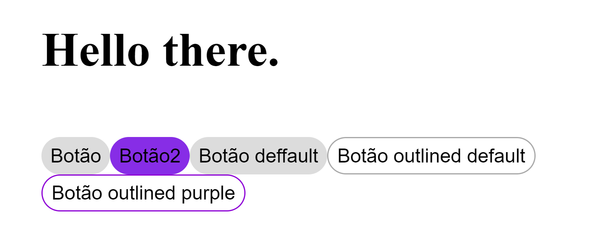

4. ## **Responsive Variant:**
    1. ### Creating:
        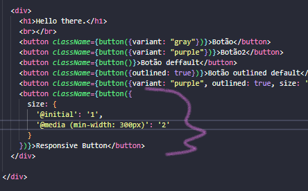

        1. #### **Visualizing in browser:**
            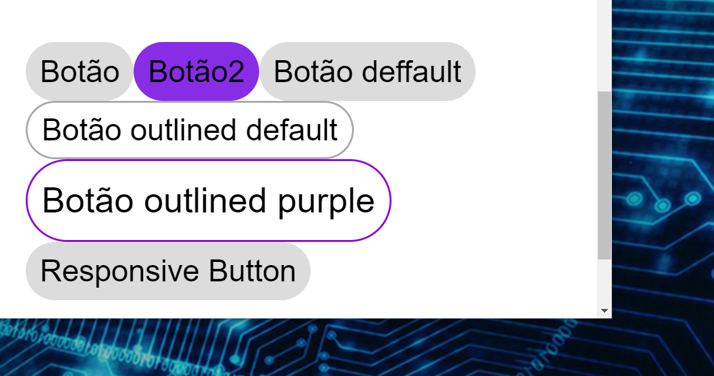
            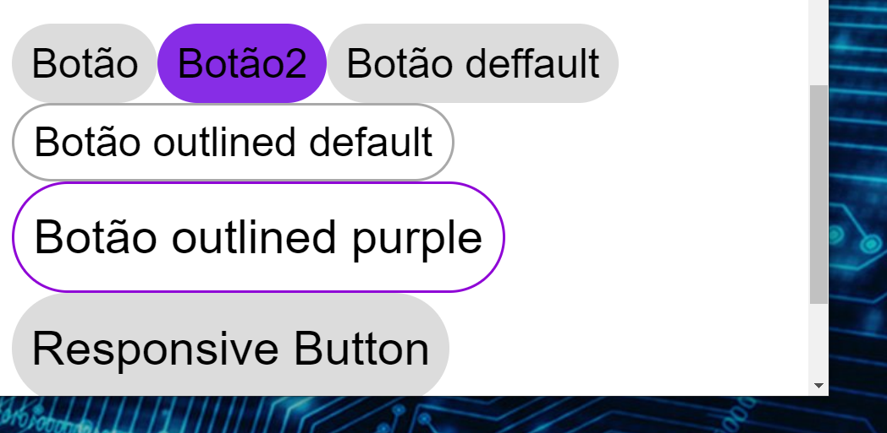

5. ## **[Criar e definir tema](https://stitches.dev/docs/tokens) na instância do Stitches:**
    1. ### **Import:**
        ```import { createStitches } from '@stitches/react';```

    2. ### **Create:**
        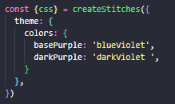

    3. ### **Implement it:**
        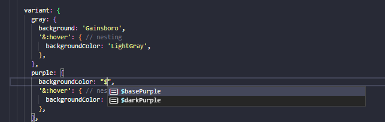

    - Uso de variáveis CSS (o que é bom!)
    - Uso dos tokens da documentação.


***

<br>

- ### **Please, be welcome to check my profile:** :nerd_face::handshake:

<br>

<a href="https://github.com/DanScherr">
    
</a>