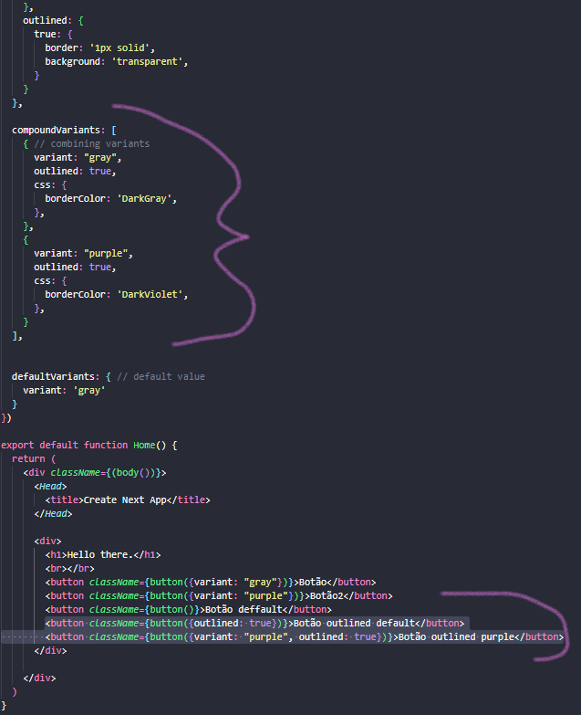

# **Learning Courses:** :books::brain:

<br>

### This is the ***root directory*** of all my learning of **REACT.JS**: :mortar_board::closed_book::robot:

<br>

# **SUMÁRIO:** :round_pushpin:

<br>

1. **[STITCHES](#stitches)**
    1. **[Create Next.js app](#create-nextjs-app)**
    1. **[Install and configure Stitches](#install-and-configure-stitches)**
    1. **[Usint it](#using-it)**
        1. **[Using CSS](#using-css)**
        1. **[Creating Variants](#creating-variants)**
        1. **[Combining Variants](#combining-variants)**
        1. **[Responsive Variants](#responsive-variant)**
        1. **[Create and Define Theme](#create-and-define-theme-in-the-instance-of-stitches)**

1. **[RADIX](#radix)**
    1. **[Working with Color Sistems](#working-with-color-system)**
    1. **[Creating a Dialog Element](#creating-a-dialog-element)**
        1. **[Elemento Coringa](#elemento-coringa)**
        1. **[Making it accessible for people with disabilities](#making-it-accessible-for-people-with-disabilities)**

<br>

***

<br>

# **STITCHES:**
**BACK TO [THE TOP](#learning-courses-booksbrain)** :point_left::top:

- # **Create Next.js app:**
    **BACK TO [THE TOP](#learning-courses-booksbrain)** :point_left::top:
    1. If not, install yarn:

        ```$ npm install --global yarn```

    2. Create Next app:
        
        ```$ yarn create next-app```

    3. Run app:
        1. Enter app directory
            
            ```$ cd {app-directory}```

        2. Run dev
            
            ```$ yarn dev```

- # **[Install and Configure Stitches:](https://stitches.dev/docs/installation)**
    **BACK TO [THE TOP](#learning-courses-booksbrain)** :point_left::top:

    1. ## **With npm:**
        ```npm install @stitches/react```

    2. ## **With yarn:**
        ```yarn add @stitches/react```


- # **Using it:**
    **BACK TO [THE TOP](#learning-courses-booksbrain)** :point_left::top:

    1. ## **Using css:**
        **BACK TO [THE TOP](#learning-courses-booksbrain)** :point_left::top:

        1. ### Import:
            ```import { css } from '@stitches/react';```
        
        2. ### Using:
            

            

    2. ## **Creating Variants:**
        **BACK TO [THE TOP](#learning-courses-booksbrain)** :point_left::top:

        1. ### **Implementing it:**
            

            1. #### **Visualizing in browser:**
                

        2. ### **Default:**
            

            1. #### **Visualizing in browser:**
                

        
    3. ## **Combining Variants:**
        **BACK TO [THE TOP](#learning-courses-booksbrain)** :point_left::top:

        1. ### Creating:
            

            1. ### **Visualizing in browser:**
                

    4. ## **Responsive Variant:**
        **BACK TO [THE TOP](#learning-courses-booksbrain)** :point_left::top:

        1. ### Creating:
            

            1. #### **Visualizing in browser:**
                
                

    5. ## **[Create and Define Theme](https://stitches.dev/docs/tokens) in the instance of Stitches:**
        **BACK TO [THE TOP](#learning-courses-booksbrain)** :point_left::top:

        1. ### **Import:**
            ```import { createStitches } from '@stitches/react';```

        2. ### **Create:**
            

        3. ### **Implement it:**
            

        - Uso de variáveis CSS (o que é bom!)
        - Uso dos tokens da documentação.

<br>

***

<br>

# **RADIX:**

1. # **Working with [color system](https://www.radix-ui.com/colors):**
    **BACK TO [THE TOP](#learning-courses-booksbrain)** :point_left::top:
    1. ## **Installing it:**

        ```yarn add @radix-ui/colors```

    2. ## **Importing it:**
        
        ```import { violet, slate } from '@radix-ui/colors'```

        - we'll get the colors inside the {}

        - if we printed the color (console.log(violet)):
            - we would get a scale from 1 to 12 and in each token there's a value of a color.
            
            

2. # **Creating a Dialog Element:**
    **BACK TO [THE TOP](#learning-courses-booksbrain)** :point_left::top:

    1. We'll use it in our created Stitches theme (css):

        

    2. We'll reconfigure our tokens in our constants:
        - We have to use the correct color number [in the right place](https://www.radix-ui.com/docs/colors/palette-composition/understanding-the-scale):

            


    3. ## **Elemento Coringa:**
        **BACK TO [THE TOP](#learning-courses-booksbrain)** :point_left::top:

        - we instantiate an empty css object

            ```const box = css({}) // vazio para ser acessado no código```

        - And then we can use it in our code as we wish:
            

        - We can also use inheritance to create a css style cascade:
            
            
            

    4. ## **Making it accessible for people with disabilities:**
        **BACK TO [THE TOP](#learning-courses-booksbrain)** :point_left::top:

        1. Check specifications [on documentation](https://www.radix-ui.com/docs/primitives/components/dialog):
            1. Install:

                ```npm install @radix-ui/react-dialog```

            2. Implement Anatomy:
                - It's no longer necessary the React.useState

                

        - ### **For more UI Components, [check in here.](https://www.radix-ui.com/docs/primitives/overview/introduction)**


<br><br>

***
***

<br><br>

- ### **Please, be welcome to check my profile:** :nerd_face::handshake:

<br>

<a href="https://github.com/DanScherr">
    
</a>