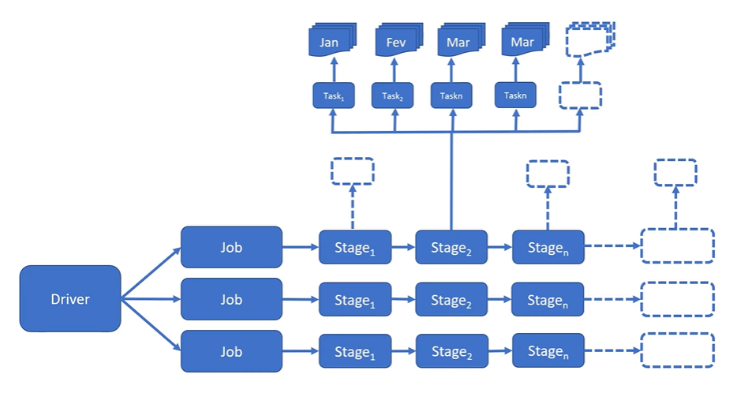
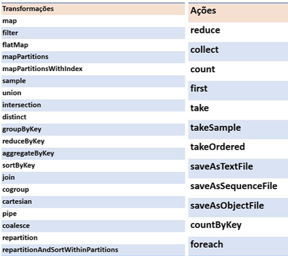
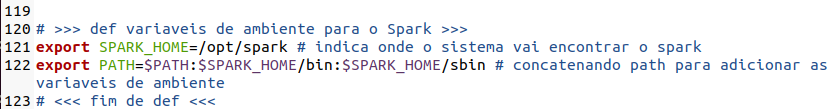
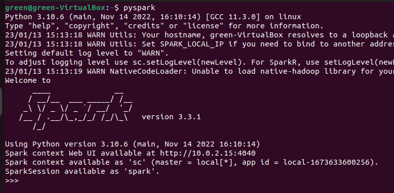

# **Learning Courses:** :books::brain:

<br>

### This is the ***root directory*** of **Spark** studies with **PySpark**: :mortar_board::closed_book::robot:

<br>

# **SUMÁRIO:** :round_pushpin:

<br>

- [Introdução](#introdução-man_studentbooks)
- [Instalando Spark]()
- [Console putty para operar máquina virtual (SSH)](#console-putty-para-operar-máquina-virtual-ssh)
- [Estrutura de pastas do Spark](#estrutura-de-pastas-do-spark)
- [Estruturas de dados](#estruturas-de-dados)
- [Resumo com Jupyter Notebook](#resumo-com-jupyter-notebook)
- [Atividade](#atividade)

<br>

# **INTRODUÇÃO:** :man_student::books:
[:top: ***Voltar ao topo***](#learning-courses-booksbrain)

- ### **Arquitetura**:
    [:top: ***Voltar ao topo***](#robot-ibm-school-of-data-engineering)

    - **Driver:** Inicializar uma ***SparkSession***. Solicita recursos computacionais do ***Cluster Manager***, transforma as operações em ***DAGs*** e distribui estas pelos **Executers**.

    - **Manager:** Gerencia os recursos do cluster. 
        - **Quatro disponíveis:** built-in standalone, YARN, Meses e Kubernetes.

    - **Executer:** Roda em cada nó do cluster executando tarefas.

    

- ### **Elementos**:
    [:top: ***Voltar ao topo***](#robot-ibm-school-of-data-engineering)

    - **SparkContext**: Conexão transparente com o Cluster.
        - **Shell**:
            - Pode-se rodar um script Spark no shell (pyspark).
            - Cria-se uma sessão automaticamente chamada spark.
        - **Criando objeto em uma aplicação, arquivo .py**:
            - $ ```spark = (SparkSession 
                        .builder
                        .appname("Meuapp")
                        .getOrCreate()      )```
    - **SparkSession**: Seção. Acesso ao SparkContext.
    - **Aplication**: programa.

- ### **Componentes**:
    [:top: ***Voltar ao topo***](#robot-ibm-school-of-data-engineering)

    - **Job**: Tarefa.
    - **Stage**: Divisão do job.
    - **Task**: Menor unidade de trabalho. Uma por núcleo e por partição.

    

- ### **Transformações e ações**:
    [:top: ***Voltar ao topo***](#robot-ibm-school-of-data-engineering)

    - O processamento de transformação de fato só ocorre quando há uma ação, **Lazy Evaluation**: it only takes action after the "show" clause. In other words, if you tell spark to do some transformation operations (as filter, union, sample, etc.), it will only make them after the show clause, so that it can work a more efficient way of making them all together by simplifying the data engeneering transformation algorithym.

    

    - **Um data frame é imutável:** traz tolerância a falha
    - **Uma transformação gera um novo data frame**.

    #### **1. Transformações**:

    - **Narrow**: os dados estão em uma mesma partição

    - **Wide**: os dados estão em mais de uma partição

<br>

# **Instalação**:
[:top: ***Voltar ao topo***](#robot-ibm-school-of-data-engineering)

### **1. VM com Ubuntu**:
[:top: ***Voltar ao topo***](#robot-ibm-school-of-data-engineering)

- #### **Ubuntu Desktop**:
    - [.iso Download](https://ubuntu.com/download/desktop).

- #### **Virtual box**:
    - [Download](https://www.virtualbox.org/wiki/Downloads).

    #### **1. Instanciar máquina Ubuntu na VM**:
    - [Follow these steps](https://ubuntu.com/tutorials/how-to-run-ubuntu-desktop-on-a-virtual-machine-using-virtualbox#2-create-a-new-virtual-machine)

    #### **2. Instalando Spark na instância**:

    #### **3. Preparando o ambiente**:

    1. ```$ sudo apt update```
    2. ```$ sudo apt -y upgrade```
    #### **4. Instalando Java**:

    1. ```sudo apt install curl mlocate default-jdk -y```
    #### **5. Instalando Spark**:

    1. [Access](https://spark.apache.org/downloads.html) !
    2. Clique the link to the download page,
    3. Copy link,
    4. On terminal: ```wget <copied-link>```
    5. Extraindo arquivo tar: ```tar xvf <nome-arquivo>```
    6. Mover para past opt (onde ficam os aplicativos de pacotes de softw do linux. Questões de boas práticas): ```sudo mv <nome-pasta>/ /opt/spark```

    #### **6. Definindo variáveis de ambiente**:

    - Se encontram no arquivo **.bashrc**
    1. Editando .bashrc: ```sudo gedit ~/.bashrc```
    2. Adicionar ao final do arquivo:

    

    3. Informar o sistema que o arquivo foi atualizado: ```source ~/.bashrc```

    #### **7. Inicializando Spark**:

    1. Iniciar master stand-alone do Spark: ```start-master.sh```
    -> permite acessar o spark no local host
    2. Iniciar work-in-progress do Spark: ```start-worker.sh spark://localhost:7077```
    3. Iniciar shell do Spark Nativo (linguagem Scala): ```start-shell```
    4. Iniciar shell do Spark com PySpark: ```pyspark```

    

    - É possível rodar Script de Spark no Shell do Spark de forma interativa, ou podemos criar uma aplicação SPark .py e rodá-la no shell de comando do próprio linux.


    #### **8. Instalando bibliotecas adicionais**:

    1. Instalar o instalador de pacotes pip: ```sudo apt install python3-pip```
    2. ```pip install numpy```
    3. ```pip install pandas```

<br>

# **Console putty para operar máquina virtual (SSH):**

1. Habilitar SSH na VM
2. [Instalar putty](https://www.chiark.greenend.org.uk/~sgtatham/putty/latest.html) no Windows.
3. Configurar no Linux: 
    1. ```sudo apt install openssh-server```
    2. desligar máquina virtual
    3. na VirtualBox acessar configurações da máquina -> Rede -> aba Adaptador 1 -> avancado -> Redirecionamento de portas -> Adicionar -> Configurar:
        {
            Nome: ssh;
            Protocolo: TCP;
            End Ip do Hosp: 127.0.0.1;
            Porta Hosp: 22;
            Porta Conv: 22
        }
    -> "ok" -> "ok"
    4. Iniciar máquina virtual
4. COnfigurar putty:
    1. Configurar: {
        Host Name (IP): 127.0.0.1,
        Porta: 22
    }
    2. clicar "Open"
    3. Fazer Log-in
5. Acessar


# **Estrutura de pastas do Spark:**
[:top: ***Voltar ao topo***](#robot-ibm-school-of-data-engineering)

- /opt/saprl/
- /examples/src/main/python/: exemplos para rodar
    - para executar: ```run-example SparkPi``` --> calculo de pi
    - script de contagem de palavra com arquivos de log:
        - ```cd /var/log```
        - ```run-example JavaWordCount kern.log```

# **Baixar dados de exemplo:**
[:top: ***Voltar ao topo***](#robot-ibm-school-of-data-engineering)

- ```cd ~```
1. ```wget www.datascientist.com.br/bigdata/download.zip```
2. ```unzip download.zip```


# **Estruturas de dados:**
[:top: ***Voltar ao topo***](#robot-ibm-school-of-data-engineering)

### **1. RDDs**:
[:top: ***Voltar ao topo***](#robot-ibm-school-of-data-engineering)

- Estrutura básica de baixo nível, complexo e verboso
- Dados imutáveis distribuídos nos clusters
- Em memória
- Pode ser persistido em disco
- Tolerante a falha
- Operações sobre um RDD criam um novo RDD (por serem imutáveis)

    #### **1 Transformações e ações de um RDD**:
    

    #### **2. Rodando exemplo na VM**:
    - **Ações**:

        

    - **Transformação**:
        - como é imutável, é necessário atribuir a outra variavel;
        - resultado só será visto após uma ação;

            

            

            

            

    - **Exemplo:**
        - Estrutura de dicionario: (chave, valor)

        

        


### **2. Data Set**:
[:top: ***Voltar ao topo***](#robot-ibm-school-of-data-engineering)
- Semelhante a uma tabela de banco de dados
- Compatível com objetos Dataframe do R e Python
- ***Disponível apenas em Java e Scala (ñ em R e Python)***

### **3. Data Frame**: 
[:top: ***Voltar ao topo***](#robot-ibm-school-of-data-engineering)
- Semelhante a uma tabela de banco de dados
- Compatível com objetos Dataframe do R e Python
- ***Disponível em R e Python***´
- Tabelas com linhas e colunas;
- Imutáveis;
- Com schema conhecido;
- Linhagem preservada (preserva as etapas que o dataframe vem sendo transformado);
- Colunas podem ter tipos da dados diferentes;
- Existem análises comuns: agrupar, ordenar e filtrar;
- Spark pode otimizar estas analises através de planos de execução (processamento so ocorre após uma ação - Lazy Evaluation).
- Tipos de dados:
    
    
    - É possível deixar para o Spark inferir o Schema a partir de parte dos dados,
    - definir você mesmo o Schema,
        - vantagens: tipo correto e sem overhead.

    <br>

    #### **1. Funções e Atributos comuns:**
    - **Exemplo - DataFrame:**
        - [from pyspark.sql import SparkSession](https://spark.apache.org/docs/3.1.1/api/python/reference/api/pyspark.sql.SparkSession.html)
        - [pyspark.sql.SparkSession.createDataFrame()](https://spark.apache.org/docs/3.1.1/api/python/reference/api/pyspark.sql.SparkSession.createDataFrame.html)
        - [pyspark.sql.DataFrame.show()](https://spark.apache.org/docs/3.2.0/api/python/reference/api/pyspark.sql.DataFrame.show.html#)

            

    - **Example - Group By:**
        - [from pyspark.sql.function import sum](https://spark.apache.org/docs/3.2.0/api/python/reference/api/pyspark.sql.functions.sum.html)
        - [pyspark.sql.DataFrame.groupBy()](https://spark.apache.org/docs/3.2.0/api/python/reference/api/pyspark.sql.DataFrame.groupBy.html)

            

    - **Example - Select**:
        - [pyspark.sql.DataFrame.select()](https://spark.apache.org/docs/3.2.0/api/python/reference/api/pyspark.sql.DataFrame.select.html)

            

        - [pyspark.sql.DataFrame.selectExpr()](https://spark.apache.org/docs/3.2.0/api/python/reference/api/pyspark.sql.DataFrame.selectExpr.html)

            

    - **Example - Dataframe Atributes**:
        - [pyspark.sql.DataFrame.schema]()
        - [pyspark.sql.DataFrame.columns]()

            

    #### **2. Importing Data**:
    - from pyspark.sql.types import *
    - [pyspark.sql.SparkSession.read](https://spark.apache.org/docs/3.2.0/api/python/reference/api/pyspark.sql.SparkSession.read.html)

        <br>

        1. [pyspark.sql.DataFrameReader.csv()](https://spark.apache.org/docs/3.2.0/api/python/reference/api/pyspark.sql.DataFrameReader.csv.html)

            

        2. [pyspark.sql.DataFrameReader.load()](https://spark.apache.org/docs/3.2.0/api/python/reference/api/pyspark.sql.DataFrameReader.load.html)

            

        - Comparando so métodos:

            

    #### **3. Filtrando dados:**
    - from pyspark.sql import functions as Func
    - [pyspark.sql.DataFrame.where()](https://spark.apache.org/docs/3.2.0/api/python/reference/api/pyspark.sql.DataFrame.where.html)

        

    #### **4. Trabalhando com colunas e views:**
    - [pyspark.sql.DataFrame.withColumnRenamed()](https://spark.apache.org/docs/3.2.0/api/python/reference/api/pyspark.sql.DataFrame.withColumnRenamed.html)

        

    - [pyspark.sql.functions.year()](https://spark.apache.org/docs/3.2.0/api/python/reference/api/pyspark.sql.functions.year.html)

        

        

# **Resumo com Jupyter Notebook**:
- [Access to view](./spark.ipynb). :point_left::computer_mouse:

# **Atividade:**

1. ### **Atividade**
    1. Crie uma consulta que mostre nesta ordem, Nome, Estados e Status do cliente.
    2. Cire uma consulta que mostre apenas os clientes do Status "platinum" e "gold".
    3. Demonstre quanto cada Status de Clientes representa em vendas?

        - Resolver com DataFrames.
        - Utilizar joins se necessário.

        - [Access to view](./atividade-1.ipynb). :point_left::computer_mouse:

<br>

<br>

***

<br>

- ### **Please, be welcome to check my profile:** :nerd_face::handshake:

<br>

<a href="https://github.com/DanScherr">
    
</a>