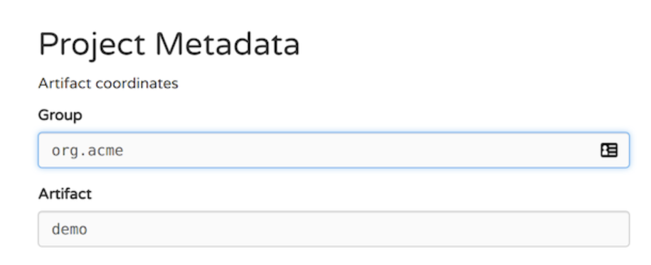
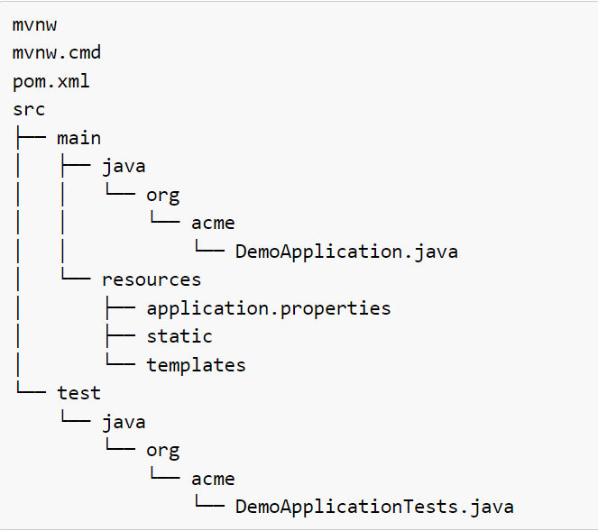

# **Learning Courses:** :books::brain:

<br>

### This is the ***root directory*** of **Spring Boot** studies: :mortar_board::closed_book::robot:

<br>

# **SUMÁRIO:** :round_pushpin:

<br>

- ## **[Introdução](#introdução)** :man_student::books:
- ## **[Project: Game Runner](#game-runner-project)**
- ## **[Logs from Running App](#logs-from-running-app)**
- ## **[Terminology](#terminology)**
- ## **[How is Spring JAR downloaded](#how-is-spring-jar-downloaded)**
- ## **[Different dependency injection types](#different-dependency-injection-types)**
- ## **[Spring Modules](#spring-modules)**
- ## **[Spring projects](#spring-projects)**

<br>

# **Introdução**:
- ## **Spring Initializr**:
    - [Link](https://start.spring.io/).

    Focus config on:
    - Group
    - Artifact

    When creating a class we create a class name and package name.
    Similiar to that, whenever we create a project we'll asign a group and artifact.

    - For documentation access: [**Getting Started**](https://docs.spring.io/initializr/docs/0.4.x/reference/htmlsingle/#initializr-documentation-about).

    In resume this is the configuration and directory structure created after setting the Spring Initializer:

    

    

- ## **How does it works**:
    To let it manage the lifecycle of objects you got:
    - Mark components using annotations: @Component (and others);
    - Mark dependencies using @Autowired;

<br>

# **Game Runner Project**:

- GameRunner Class
    Game Classes:Mario, Super Contra, PacMan, etc.

    - inside src/main/java, we'll find the package where it contains our main application file.
        - where we'll construct our main code
        - where we create other packages (classes) that will be used in the main code

- ## **Iteraction 1**:
    **Tightly Coupled Class:**
    - GameRunner + MarioGame new game
    Its dependency to run a game its tightly coupled with mario game. If i want to change to run another game, we would find struggle and having to change my code, imports, instances and etc.
    
- ## **Iteraction 2**
    **Loose Coupling - Interfaces**
    - Create interface (GamingConsole)
    - implement interface on game classes (super contra game)
    - Done: we can pass all classes that implements the interface overriding its methods in a very simple way.

- ## **Iteraction 3**:
    **Loose Coupled Class 2 level**
    - in 1 lvl we need 2 steps to implementat main code: 
        1. instaciation of game
        2. instaciation of runner
        - This creates a **dependency** of runner to game (it needs to instanciate game to instanciate runner)
    - Instead, we'll tell spring framework to create those game instances whenever necessary.
        - 1. add the annotation ```@Component``` (PacMan, GamingConsole, GameRunner) above class definition in each class we want Spring boot to manage.
        - 2. add the annotation ```@Autowired``` to create a dependency injection on the atribute you want Spring to manage (GameRunner - definnition of game variable).
            - Spring Frameworks manages this in the application context.
        - 3. Import and configure ```ConfigurableApplicationContext context = SpringApplication.run(IntroApplication.class, args);``` in our main code.
        - 4. Instantiate components with context getBean() method.

        - When we launch Spring Application Context Spring FrameWrok creates an instance for all components we can pick up components instances (bean) from the Spring Context and execute it in our main code.

<br>

# **Logs from Running App:**

1. src/main/resources/ application.properties
- configure logging level:
    ```logging.level.org.springframework=debug```
- we'll see INFO and DEBUG logs as well.

<br>

# **Terminology**:
- **Application Context**
- **Tight Coupling and Loose Coupling**
- **IOC Container**: Manages lifecycle of beans and dependencies.
    - ApplicationContext (complex);
    - BeanFactory (simpler features - rarely used).
- **Dependency**: GameRunner needs GamingConsole implemented to be able to work (create an instance of).
- **Dependency Injection**: identify beans, their dependencies and wire them together (provides IOC - inversion of control)
    - **Spring Beans**: an object managed by Spring Framework
        - **@Component**: Class managed by Spring framework
    - **Auto Wiring**: Process of wiring in dependencies for a Sprin Bean
    - **Component Scan**: part of @SpingBootApplication that does a @ComponentScan("") in the current package automatically (and subpackages), finding all classes and dependecies that have the @Component annotation.
    - You can Scan multiple packages: @ComponentScan({"", "", ""})

<br>

# **How is Spring JAR downloaded?**
**Maven**!!!
- Defines a simple project setup that follows best practices.
- Enables consistent usage across all projects.
- Manages dependency updates and transitive dependencies

How?
- Manages the JARs needed by the application and by our app dependencies.
- Located at ./Maven Dependencies
- Configured on ./pom.xml
    - Identified by Group Id and Artifact Id.

<br>

# **Different Dependency Injection Types**:
- **Constructor-based**: Dependencies are set by creating the Beam and using its Constructor (used in game)
- **Field**: No setter or constructor. Dependency is injected using reflection. (used in data service)
- **Setter-bassed**: Dependencies are set by calling setter methods on your beans. (not examplified but if setters are added to the class, it will prefer the setter-based injection to field-based).

- it's recommended to use constructor-based Injection because it's created on the creation of the object.

<br>

# **Spring Modules**:
- Core: IoC Container etc.
- Testing: Mock Objects, Spring MVC Test etc
- Data Access: Transactions, JDBC, JPA etc
- Web Servlet: Spring MVC etc
- Web Reactive: Spring WebFlux etc
- Integration: JMS etc

<br>

# **Spring Projects**:
- SpringBoot: most popular to build microservices;
- SpringCloud: cloude native applications;
- SpringData: integrate the same way with different types of databases: NoSQL and Relational;
- SpringIntegration: Address challenges with integration with other applications;
- SpringSecurity: Secure your web application or REST API or microservice.

<br>

***

<br>

- ### **Please, be welcome to check my profile:** :nerd_face::handshake:

<br>

<a href="https://github.com/DanScherr">
    
</a>