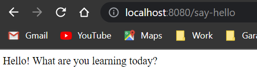
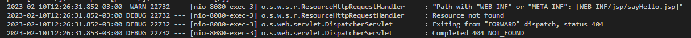
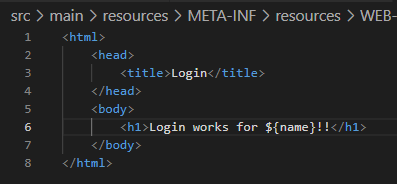
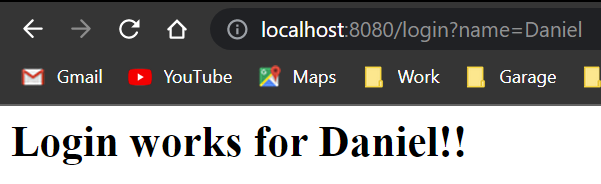
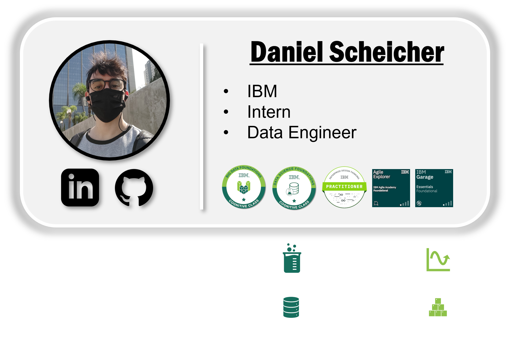

# **Learning Courses:** :books::brain:

<br>

### This is the ***root directory*** of **Spring Boot** studies: :mortar_board::closed_book::robot:

<br>

# **SUMÁRIO:** :round_pushpin:

<br>

- ## **[Intro](./1-intro/)**


<br>

# **Introduction**:
- Complex:
    - Web app concepts: Browser, HTML, CSS, Request, Response, Form, Session, Authentication;
    - Spring MVC: Dispathcer Servlet, View Resolvers, Model, View, Controller, Validations, ..;
    - Spring Boot: Starters, Auto Configuration, ...;
    - Frameworks/Tools: JSP, JSTL, JPA, Bootstrap, Spring Security, MYSQL, H2.


<br>

# **Web App - To Do Management**:

- ## **Intro**:
    - ### **Main Files**:
        - **MyFistwebappAplication.java**: main code;
        - **application.properties**: config details about app;
            - server.port=8081 // example to change app port
        - **pom.xml**: find all of our dependencies rellated to the application

<br>

1. ## **First Spring MVC Controller**:
    - ### **Delivery Goal:** 
        Simple hello world response from our web application!
    - ### **Main Annotations**:
        - ***@RequestMapping("{url}")*** -> tied to a method
        - ***@ResponseBody*** -> tied to a method
        - ***@Controller*** -> tied to a class
    - ### **Say Hello World**:
        1. **Create a new Package (subPackage) in our main Artifact folder**:
            */myfirstwebapp/hello/
        1. **Create new Class inside our new hello Artifact folder**:
            */myfirstwebapp/hello/SayHelloController.java
            1. **Implement sayHello() method**;
            1. **Configure url to call for sayHello() method**:
                1. Use Spring MVC annotation **@RequestMapping("{url}")** above sayHello() method, to **map automatically an url resource** to this method;
                    - if we refresh on the url configured, we'll get an error, so we need to configure next step..
                1. Configure Spring MVC annotation **@Controller** to SayHelloController Class;
                    - if we refresh on the url configured, we'll get an error, because Spring MVC will look for a View with an specific name, not a string as ease. Thats why we need to configure the next step..
                1. Configure Spring MVC annotation **@ResponseBody** to sayHello() method;
                    - The string we have on the method will be returned as ease to the browser.

                    

<br>

2. ## **Create Method to Return HTML pack:**
    We'll be creating our method in the created subPackage/Class created on [here](#1-first-spring-mvc-controller).

    - ### **Main learning**:
        - **Class.Object**:
            - **StringBuffer**: 
                - **StringBuffer.append() method**: allows us to respond a html page.
                - **StringBuffer.toString() method**: allows us to return a html page.
        
    - ### **HTML response**:
        1. Create new method sayHelloHtml():
        1. Configure the Annotations following [1.2.2 of these steps.](#1-first-spring-mvc-controller).
        1. Use **StringBuffer** object and its **append() and toString() method** to return back a html code.

<br>

3. ## **Redirect to a JSP (View)**:
    We'll be creating our method in the created subPackage/Class created on [here](#1-first-spring-mvc-controller).

    - ### **Main learning**:
        - **JSP View**;
        - **application.properties**: preffix and suffix configs;
        - **pom.xml**: adding dependecy.

    1. ### **JSP response**:
        1. Create new method sayHelloJsp():
        1. Configure the Annotations following [1.2.2 of these steps.](#1-first-spring-mvc-controller).
        1. **All the JSP should be created on the folder** (defined by Spring Boot): 
            ```*\src\main\resources\META-ING\resources\WEB-INF\jsp\sayHello.jsp```
            1. **Creating our View:**
                Paste our html code on the .jsp file.
            1. **Add prefix path** of our .jsp files to **application.properties**.
                - Easily configure the preffix and suffix because it's already configured in spring.mvc
        1. **Remove** the **@ResponseBody Annotation**, because we'll be returning a view.
            - Configure logging on application.properties for debugging;
            - After removing we'll get an error because Spring will be redirecting to the JSP view directory:
                
                

        1. **Configure pom.xml**:
            - **add dependency**:
                - grouID: org.apache.tomcat.embed
                - artifactId: tomcat-embed-jasper
                - scope: provided

        

4. ## Create Login Page (challenge):
- Followed [3.1. steps](#redirect-to-a-jsp-view)!

4. ## QueryParams using RequestParam
    - ### **Main learning**:
        - **Annotation**:
            - **@RequestPara**m -> methods param
    - ### **Main learning**:
        - **Annotation**:
            - **@RequestParam**
        - **JSP View**: how to use Query Params?
            - **Model**
        - **Class/object**:
            - **ModelMap**
        - Expression Language
    - What can we do if we want to pass a name through the url?
    - We can **use QueryParams**:
        /login***?name=Daniel***
    1. Add and configure **@RequestParam** Annotation to the method params.
    2. Use **Model** to pass a param from Controller to our JSP View:
        1. Add a ModelMap object to the method's param.
        2. Use .put() method in the Response method with the atribute and value that will be passed.
    3. Add Expression Language to our jsp file with ${} notation.

        
        

5. ## 
            
<br>


***

<br>

- ### **Please, be welcome to check my profile:** :nerd_face::handshake:

<br>

<a href="https://github.com/DanScherr">
    
</a>