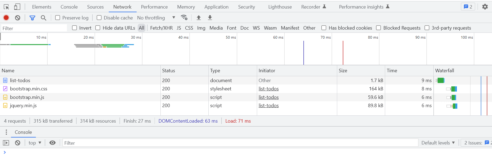

# **Learning Courses:** :books::brain:

<br>

### This is the ***root directory*** of **Spring Boot** studies: :mortar_board::closed_book::robot:

<br>

# **SUMÁRIO:** :round_pushpin:

<br>

- ## **[Intro](./1-intro/)**


<br>

# **Introduction**:
- Complex:
    - Web app concepts: Browser, HTML, CSS, Request, Response, Form, Session, Authentication;
    - Spring MVC: Dispathcer Servlet, View Resolvers, Model, View, Controller, Validations, ..;
    - Spring Boot: Starters, Auto Configuration, ...;
    - Frameworks/Tools: JSP, JSTL, JPA, Bootstrap, Spring Security, MYSQL, H2.


<br>

# **Web App - To Do Management**:

- ## **Intro**:
    - ### **Main Files**:
        - **MyFistwebappAplication.java**: main code;
        - **application.properties**: config details about app;
            - server.port=8081 // example to change app port
        - **pom.xml**: find all of our dependencies rellated to the application

<br>

1. ## **First Spring MVC Controller**:
    - ### **Delivery Goal:** 
        Simple hello world response from our web application!
    - ### **Main Annotations**:
        - ***@RequestMapping("{url}")*** -> tied to a method
        - ***@ResponseBody*** -> tied to a method
        - ***@Controller*** -> tied to a class
    - ### **Say Hello World**:
        1. **Create a new Package (subPackage) in our main Artifact folder**:
            */myfirstwebapp/hello/
        1. **Create new Class inside our new hello Artifact folder**:
            */myfirstwebapp/hello/SayHelloController.java
            1. **Implement sayHello() method**;
            1. **Configure url to call for sayHello() method**:
                1. Use Spring MVC annotation **@RequestMapping("{url}")** above sayHello() method, to **map automatically an url resource** to this method;
                    - if we refresh on the url configured, we'll get an error, so we need to configure next step..
                1. Configure Spring MVC annotation **@Controller** to SayHelloController Class;
                    - if we refresh on the url configured, we'll get an error, because Spring MVC will look for a View with an specific name, not a string as ease. Thats why we need to configure the next step..
                1. Configure Spring MVC annotation **@ResponseBody** to sayHello() method;
                    - The string we have on the method will be returned as ease to the browser.

                    

<br>

2. ## **Create Method to Return HTML pack:**
    We'll be creating our method in the created subPackage/Class created on [here](#1-first-spring-mvc-controller).

    - ### **Main learning**:
        - **Class.Object**:
            - **StringBuffer**: 
                - **StringBuffer.append() method**: allows us to respond a html page.
                - **StringBuffer.toString() method**: allows us to return a html page.
        
    - ### **HTML response**:
        1. Create new method sayHelloHtml():
        1. Configure the Annotations following [1.2.2 of these steps.](#1-first-spring-mvc-controller).
        1. Use **StringBuffer** object and its **append() and toString() method** to return back a html code.

<br>

3. ## **Redirect to a JSP (View)**:
    We'll be creating our method in the created subPackage/Class created on [here](#1-first-spring-mvc-controller).

    - ### **Main learning**:
        - **JSP View**;
        - **application.properties**: preffix and suffix configs;
        - **pom.xml**: adding dependecy.

    1. ### **JSP response**:
        1. Create new method sayHelloJsp():
        1. Configure the Annotations following [1.2.2 of these steps.](#1-first-spring-mvc-controller).
        1. **All the JSP should be created on the folder** (defined by Spring Boot): 
            ```*\src\main\resources\META-ING\resources\WEB-INF\jsp\sayHello.jsp```
            1. **Creating our View:**
                Paste our html code on the .jsp file.
            1. **Add prefix path** of our .jsp files to **application.properties**.
                - Easily configure the preffix and suffix because it's already configured in spring.mvc
        1. **Remove** the **@ResponseBody Annotation**, because we'll be returning a view.
            - Configure logging on application.properties for debugging;
            - After removing we'll get an error because Spring will be redirecting to the JSP view directory:
                
                

        1. **Configure pom.xml**:
            - **add dependency**:
                - grouID: org.apache.tomcat.embed
                - artifactId: tomcat-embed-jasper
                - scope: provided

        

4. ## **Create Login Page (challenge)**:
- Followed [3.1. steps](#redirect-to-a-jsp-view)!

4. ## **QueryParams using RequestParam**:
    - ### **Main learning**:
        - **Annotation**:
            - **@RequestPara**m -> methods param
    - ### **Main learning**:
        - **Annotation**:
            - **@RequestParam**
        - **JSP View**: how to use Query Params?
            - **Model**
        - **Class/object**:
            - **ModelMap**
        - Expression Language
    - What can we do if we want to pass a name through the url?
    - We can **use QueryParams**:
        /login***?name=Daniel***
    1. Add and configure **@RequestParam** Annotation to the method params.
    2. Use **Model** to pass a param from Controller to our JSP View:
        1. Add a ModelMap object to the method's param.
        2. Use .put() method in the Response method with the atribute and value that will be passed.
    3. Add Expression Language to our jsp file with ${} notation.

        
        

5. ## **Logging**:
    Configured in ***application.properties***.
    - ## Entire Application level configuration:
        ```logging.level.org.springframework=info```
    - ## Logging an specific package:
        ```loging.level.com.in28minutes.springboot.myfirstwebapp=debug```
    - ## Adding logging into our application:
        1. Instead of using println to logging things in our console, we'll create an object of Logger.LoggerFactory.getLogger(getClass()) (in loginController.java).
        2. Use logger.info("String {}", {atribute/method/etc.})

6. ## **DispatcherServlet**:
    1. Model 1:
        - In the past all logic was applied inside the View.
    2. Model 2:
        - Separeted into:
            - **Model**: Data to generate the view;
            - **View**: Show information to user;
            - **Controller**: Controls the flow.
    3. Model 2 + Front Controller:
        - A front controller to implement all security, authorization in this layer and then send to next layer and place;
            - Where we can implement common features
            - Logic:
                1. Receives HTTP Request;
                2. Process HTTP Request;
                    1. Identifies correct Controller method (based on the request)
                2. Executes Controller method:
                    - Returns Model and View name;
                3. Identifies correct View, using ViewResolver
                4. Executes View;
                5. Returns HTTP Response.

7. ## **Creating a Login Form**:
    1. On the login.jsp:
        1. Implement form with post method;
            - So that the inputs of the fields do not show on the url as a get request.
            - The information will be passed as a form data.
    - To check what is the nature of the request: inspect => Network => Reload Page

8. ## **Creating a Welcome Page**:
    - So that the user can be redirected after loging in;
    1. Add a request param (**method=RequestMethod.GET**) in the **@RequestMapping** Annotation as GET and POST;
        1. Creating GET method to enter the Login Page;
            - return Login
        2. Creating POST method to validate Login and return the Welcome Page;
            - return welcome
        3. Authenticate Username and Password:
            - Use of @RequestParam Annotation in the POST method Param to get data from form data;
            - Use of ModelMap in the POST method Param to pass data to a page;
            - Use model.put to map and pass the data to the page;
    - To check what is the nature of the request: inspect => Network => Reload Page

9. ## **Add hard code validation of username and password**:
    1. Separate a different class
        - Called AuthenticationService
        - Add @Service Annotation to it so that Spring can autowire it

10. ## **Getting Started with ToDo Features**:
    1. ToDo main:
        - POO logic (Models);
        - atributes
        - getters and setters

    1. ToDoService:
        - Backend logic (Database integration);
        1. Add @Service;
    
    1. ToDoController:
        - Request logic (Resources);
        1. Add @Controller;
        2. Add @RequestMapping;
        3. Import and instanciate an obj of ToDoService and set it on constructor method;


    1. ToDo View (JSP):
        - Front-end logic (View);

10. ## **Session vs Model vs Request**:
    - **Model**: the data can only be accessed by the scope of that request;
        - Once the response is sent back, the request attributes will be removed from memory;
    - **Session**: the data can be stored across multiple requests;
        - uses @**SessionAtributes({atribute})** Annotation;
        - need to use the annotation with same parameter to all controllers that you're going to use it;

11. ## **Adding JSTL into Spring Boot Project**:
    - until now we've been using expression language (${}) to show data in our pages;
    - we make use o JSTL to show mora dynamic and complex data in our pages;
    1. Need to add new dependencies in our pom.xml;
        - ```jakarta.servlet.jsp.jstl```
        - ```org.eclipse.jetty```
    2. In each View we need to add a tag:
        - ```<% taglib uri="http://" %>``` -> the one we're going to use (forEach) is in the root of the [library](https://docs.oracle.com/javaee/5/jstl/1.1/docs/tlddocs/c/tld-summary.html); -> ```<%@ taglib prefix="c" uri="http://java.sun.com/jsp/jstl/core" %>```
    3. Implement the JSTL function in our View;
    4. Implement code in View

12. ## **Adding CSS Bootstrap Framework into our View:**
    1. Add dependency on pom.xml to use bootstrap;
        - it'll be downloaded on ```Maven Dependencies'/'bootstrap```
        - to make use of **css file**: 
            copy file location of ```/META-INF/resources/webjars/bootstrap/5.1.3/css/bootstrap.min.css``` => to get minimized css version;
        - to make use of **js file**: 
            copy file location of ```/META-INF/resources/webjars/bootstrap/5.1.3/js/bootstrap.min.js``` => to get minimized js version;
        - to make use of **jquery**:
            copy file location of: ```/META-INF/resources/webjars/jquery/3.6.0/jquery.min.js``` to get minimized js version;
    2. Add to our Views;
        - place the css file location on the header, above your title with the link tag;
        - place the js file location at the end of the body, with the script tag;
    3. Rebuild?
        

13. ## **Formating View pages with Bootstrap**:
    1. Making use of [**bootstrap**](https://getbootstrap.com/docs/4.0/getting-started/introduction/);
        - will be demonstrated on listTodos.jsp;
        - ***It's recomended to put all the content of the body of the page into divs with a class called container***;
        - Use **classes for tables**;
    2. Apply config and code to other Views, since 12.1.;


<br>


***

<br>

- ### **Please, be welcome to check my profile:** :nerd_face::handshake:

<br>

<a href="https://github.com/DanScherr">
    
</a>