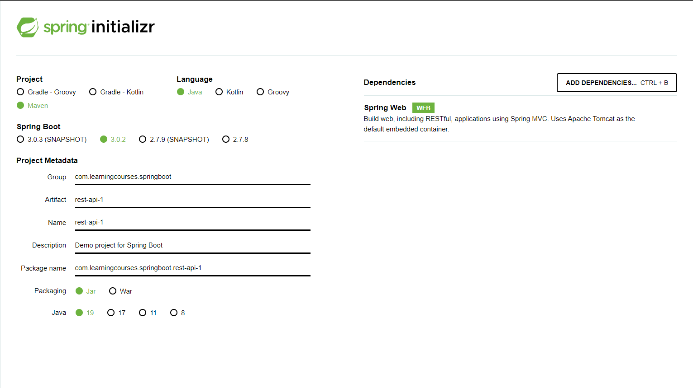

# **Learning Courses:** :books::brain:

<br>

### This is the ***root directory*** of **Spring Boot** studies: :mortar_board::closed_book::robot:

<br>

# **SUMÁRIO:** :round_pushpin:

<br>

- ## **[Introdução](./1-intro/)** :man_student::books:


<br>

# **Introduction**:

- ## **Help to build PRODUCTION-READY apps quickly**:
    - ### **Spring Initializr**
    We'll have to create a depency when creating the Spring Boot Start project with Spring Web as follows:
        

    - ### **Spring Boot Starter Projects**:
        - A lot of frameworks:
            - To build a REST API we need a lot of frameworks (Spring, Spring MVC, Tomcat, JSON conversion ...).
            - To run test we need a lot of others (Spring Test, JUnit,Mockito ...).
        - How to group them and make it easier?
            - Starters: Convenient dependency descriptors for diff. features, defined on pom.xml: <dependencies>

        - Spring Boot provides a variety of starter projects:
            - Web Application & REST API: Spring Boot Starter Web (spring-webmvc, spring-web, spring-boot-starter-tomcat, spring-boot-starter-json);
            - Unit Tests: Spring Boot Starter Test;
            - Talk to database using JPA: Spring Boot Starter Data JPA.

    - ### **Spring Boot Auto Configuration**:
        Automated configuration is based on which frameworks are in the **Class Path** and the **existing configuration** (Annotations, etc.).
        - All the autoconfiguration logic is defined on:
             ```C:\Users\017924631\.m2\repository\org\springframework\boot\spring-boot-autoconfigure\3.0.2\spring-boot-autoconfigure-3.0.2.jar```
        - Configure ```src\main\resources\application.properties```, **to understand autoconfig**, with the code: ```logging.level.org.springframework=debug```

- ## **Spring Boot DevTools**:

    - ### **Logging Configuration**
        Set on application.properties
        - trace
        - debug
        - info
        - warning
        - error
        - off

    - ### Automatically building config:
        Increase developer productivity
        - Add dependency on pom.xml
            ```
            <dependency>
                <groupId>org.springframework.boot</groupId>
                <artifactId>spring-boot-devtools</artifactId>
            </dependency>
            ```
        - It aims on increase developer productivity. **Don't need to rebuild**, just save your files that **it'll rebuild online automatically**.
        - For **pom.xml** dependency changes, you'll need to restart server **manually**.

    - ### Profiles:
        1. **Managing App**: configuration using profiles
            - diff environments: Dev, QA, Stage, Prod
            - diff env needs diff configuratrion
                - diff databases
                - diff web services
        
        2. **Profiles**: provision of diff config for each diff env
            1. Create an application.properties for each env:
                - application-dev.properties
                - application-prod.properties
            2. Configure an active profile for the application in the application.properties (prod will have higher priority then dev), otherwise it'll use its default.

    - ### Environments/Configuration Properties:
        - use of applicaton.properties.
        - how Spring Boot helps us to set on the applicaton.properties file and use it on our application.
            - gotta add annotation @ConfigurationPropertie(), and pass your configs set on application.properties file as arguments.
            - add @Component annotation, getters and setters so that Spring manages its atributes.
            - add a controller class with the @RestController and @RequestMapping annotation besides the @Autowired annotation to instaciate the service object created so that spring manages it.
        - if we change the configuration on application.properties, Spring will automatically refresh if Spring Boot Production-Ready is configured.
        - we can also configure specific configuration properties for different environments.

    - ### Embedded Servers:
        1. Install Java
        2. Install JAR file (Embedded server its a part of the JAR file already - Tomcat ...)
        3. Right click on project -> Maven -> Run Maven Commands -> install
        4. Jar file will be created
        - To run it:
        1. Go to ./target dir
        2. run ```java -jar {name of file}.jar```
        - Embedded Server examples:
            - spring-boot-starter-tomca: default
            - spring-boot-starter-jetty
            - spring-boot-starter-undertow
        
    - ### Actuator:
        Looking to what happens in the background of our application.
        - Helps to **Monitor and Manage** the application in **Production**.
        - Provides a number of endpoints.
            - Beans: complete list of Spring beans in the app
            - health: app health info
            - metrics: app metrics
            - mappings: details around Request Mappings
        1. **Configure in pom.xml** as a dependency.
        2. Run application.
        3. Access url-root/actuator
            - the default will show only the health endpoint
            - if we want more features we need to configure them on application.properties:
                - include: ```management.endpoints.web.exposure.include=*```. To see them all.
                - include: ```management.endpoints.web.exposure.include=health,metrics```. To see just a set of them.
    

# Spring Boot vs Spring MVVC vc Spring:
- ## **Spring Framework**: Dependency Injection
    - @Component, @Autowired, @ComponentScan, etc.
    - Just dependency injection is not sufficient, its needed other frameworks.
        - Spring modules and Spring projects: extended Spring eco system
            - provide good integration with other frameworks: Hibernate/JPA, JUnit & Mockito for Unit Testing.
- ## **Spring MVC (Spring Module)**: Simplify building web apps and REST API
    - Building web applications with Struts was very complex
    - @Controller, @RestController, @RequestMapping("/exmaple")
- ## **Spring Boot (Spring Project)**: Build PRODUCTION-READY apps QUICKLY
    - Starter Projects: Make it easy to build variety of applications
    - Auto configuration: Eliminates configuration to setup Spring, Spring MVC and other frameworks.
    - Enable non funcional requirements (NFRs):
        - **Actuator**: Emables Advanced Monitoring of Applications.
        - **Embedded Server**: No need for separate application servers.
        - **Logging and Error Handling**.
        - **Profiles and ConfigurationProperties**.


<br>

***

<br>

- ### **Please, be welcome to check my profile:** :nerd_face::handshake:

<br>

<a href="https://github.com/DanScherr">
    
</a>