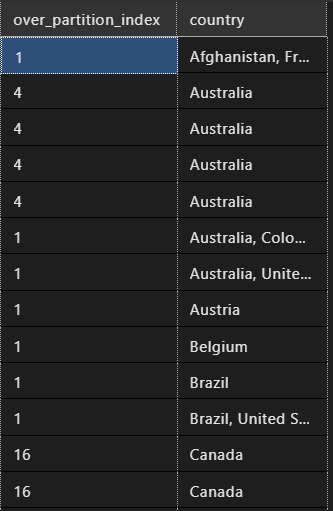
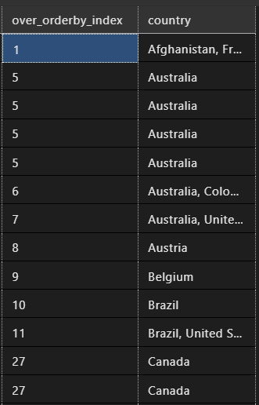
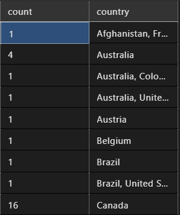
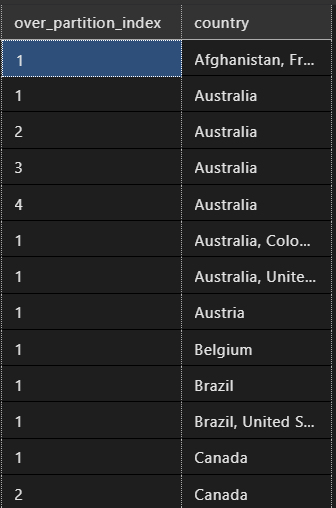
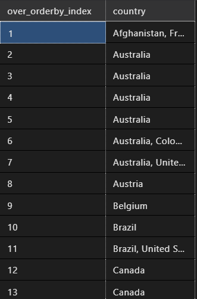
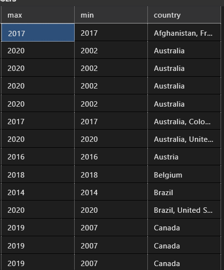
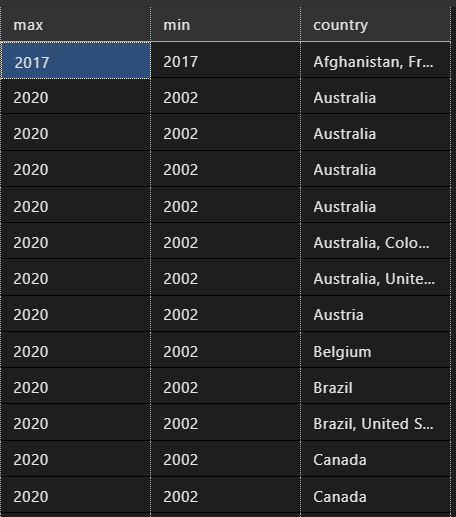
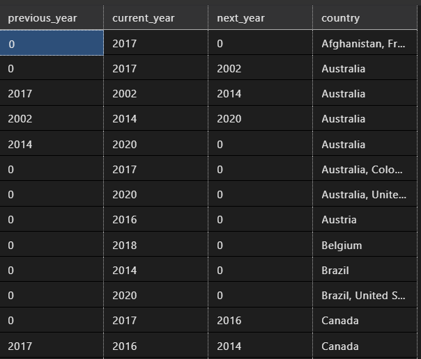
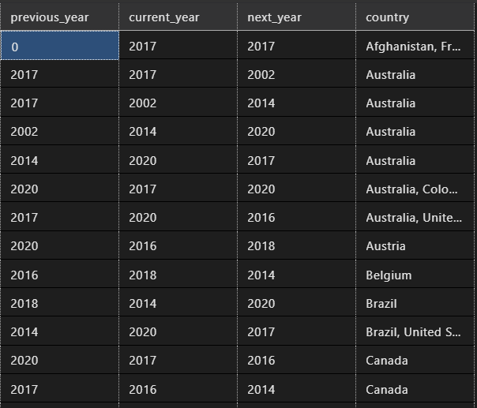

# **Learning Courses:** :books::brain:

<br>

### This is the ***root directory*** of **SQL** studies: :mortar_board::closed_book::robot:

<br>

# **SUMÁRIO:** :round_pushpin:

<br>

- [Introdução](#introdução-man_studentbooks)
- [Implementação de um banco SQL]()


<br>

# **INTRODUÇÃO:** :man_student::books:
[:top: ***Voltar ao topo***](#learning-courses-booksbrain)

- ## **Funções:**

    - ### **OVER:**
        [:top: ***Voltar ao topo***](#robot-ibm-school-of-data-engineering)

        - Determina o particionamento e a ordenação de um conjunto de linhas antes da aplicação da função de janela associada.

        ```
        OVER (   
            [ <PARTITION BY clause> ]  
            [ <ORDER BY clause> ]   
            [ <ROW or RANGE clause> ]  
            )
        ```

        - Argumentos:
            - PARTITION BY divide o conjunto de resultados da consulta em partições.
            - ORDER BY define a ordem lógica das linhas dentro de cada partição do conjunto de resultados.
            - ROWS/RANGE limita as linhas dentro da partição com a especificação de pontos iniciais e finais na partição. Isso requer o argumento ORDER BY, e o valor padrão é do início da partição até o elemento atual se o argumento ORDER BY for especificado.

        - Uma função de janela computa um valor para cada linha na janela. E estas são classificadas como:
            - Funções de [classificação](./theory/revision.md/#funções-de-classificação);
            - Funções de [agregação](./theory/revision.md/#funções-de-agregação);
            - Funções [analíticas](./theory/revision.md/#funções-analíticas);
            - Função [NEXT VALUE FOR](./theory/revision.md/#função-next-value-for).

        - As funções passadas como atenção seguem: ```Classificação: RANK e ROW_NUMBER; Analíticas: LAG e LEAD.```
        Por isso, serão cobertas 2 funções para cada tipo.

        - ### **CLASSIFICAÇÃO (RANK() E ROW_NUMBER())**:
            [:top: ***Voltar ao topo***](#robot-ibm-school-of-data-engineering)

            - #### **RANK():**
                As tabelas a seguir mostram a função [RANK()](https://learn.microsoft.com/pt-br/sql/t-sql/functions/rank-transact-sql?view=sql-server-ver16) com, respectivamente, [over partition by](./query/1-partition-by.sql), [over order by](./query/1-order-by.sql) e [group by](./query/1-count-group-by.sql).

                
                
                

                - Nota-se que **na primeira**, a contagem faz-se exclusivamente por cada partição, obedecendo a expressão dada pelo usuário. Ou seja, a contagem é zerada e realizada a partir de cada partição, indicando a contagem de linhas por partição.
                - Já **na segunda**, percebe-se que não ocorre um particionamento que segmenta a contagem, esta flui de modo ordenada, criando como se fosse um sumário, indicando o segmento relativo à expressão dada pelo usuário e a contagem da primeira ocorrência deste na tabela.
                - Por fim, **na terceira**, ocorre um ***resumo da primeira.*** Ou seja, ao invés de trazer todas as linhas da tabela (de forma repetitiva), trás a informação apenas uma vez.

            - #### **ROW_NUMBER()**: 

                - A função [ROW_NUMBER()](https://learn.microsoft.com/pt-br/sql/t-sql/functions/row-number-transact-sql?view=sql-server-ver16) numera a saída de um conjunto de resultados. Mais especificamente, retorna o número sequencial de uma linha em uma partição de um conjunto de resultados, começando em 1 na primeira linha de cada partição.

                - ROW_NUMBER e RANK são semelhantes. ROW_NUMBER numera todas as linhas em sequência (por exemplo 1, 2, 3, 4, 5). RANK fornece o mesmo valor numérico para empates (por exemplo 1, 2, 2, 4, 5).

                - Assim como a função RANK, ROW_COUNT é reiniciada por agrupamento com o PARTITION BY e empilhada com o ORDER BY, como podemos nas tabelas abaixo respectivamente, [over partition by](./query/1-partition-by.sql) e [over order by](./query/1-order-by.sql):

                
                

        - ### **3. Agregação:**
            [:top: ***Voltar ao topo***](#robot-ibm-school-of-data-engineering)

            - #### **MIN() e MAX()**
                - Assim como a função RANK e ROW_COUNT, [MIN()](https://learn.microsoft.com/pt-br/sql/t-sql/functions/min-transact-sql?view=sql-server-ver16) E [MAX()](https://learn.microsoft.com/pt-br/sql/t-sql/functions/max-transact-sql?view=sql-server-ver16) são reiniciadas por agrupamento com o PARTITION BY e empilhadas com o ORDER BY, como podemos nas tabelas abaixo respectivamente, [over partition by](./query/1-partition-by.sql) e [over order by](./query/1-order-by.sql):

                
                

        - ### **4. Analiticas:**
            [:top: ***Voltar ao topo***](#robot-ibm-school-of-data-engineering)

            - #### **LAG() e LEAD():**
                - [LAG()](https://learn.microsoft.com/pt-br/sql/t-sql/functions/lag-transact-sql?view=sql-server-ver16): Acessa os dados de uma linha anterior no mesmo conjunto de resultados sem usar uma autojunção.

                    ```
                    LAG (scalar_expression [,offset] [,default])  
                    OVER ( [ partition_by_clause ] order_by_clause )  
                    ```

                - [LEAD()](https://learn.microsoft.com/pt-br/sql/t-sql/functions/lead-transact-sql?view=sql-server-ver16): Acessa os dados de uma linha anterior no mesmo conjunto de resultados sem usar uma autojunção.

                    ```
                    LEAD (scalar_expression [,offset] [,default])  
                    OVER ( [ partition_by_clause ] order_by_clause )  
                    ```

                    - **offset**:

                        O número de linhas atrás da linha atual da qual obter um valor. Se não for especificado, o padrão será 1. offset pode ser uma coluna, subconsulta ou outra expressão avaliada para um inteiro positivo ou pode ser convertida implicitamente em bigint. offset não pode ser um valor negativo nem uma função analítica.

                    - **default**:

                        O valor a ser retornado quando offset estiver além do escopo da partição. Se um valor padrão não for especificado, NULL será retornado. default pode ser uma coluna, subconsulta ou outra expressão, mas não pode ser uma função analítica. default deve ter o tipo compatível com scalar_expression.

                - Segue a mesma lógica para partition by e order by e estão representadas nas imagens abaixo respectivamente, [over partition by](./query/1-partition-by.sql) e [over order by](./query/1-order-by.sql):
                    
                    
                    

- # IMPLEMENTAÇÃO:

    - **[Access To View](https://github.com/DanScherr/ibm-school-of-data_engineering/tree/main/5-SQL/4-Movies_table-Exercicios#ambienta%C3%A7%C3%A3o)** :point_left::computer_mouse:


<br>

***

<br>

- ### **Please, be welcome to check my profile:** :nerd_face::handshake:

<br>

<a href="https://github.com/DanScherr">
    
</a>